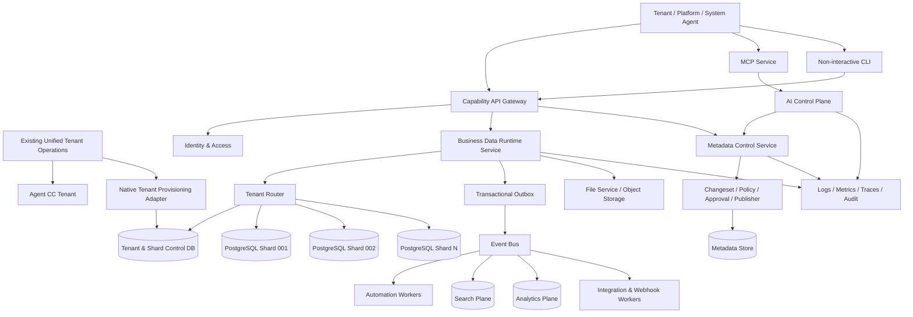
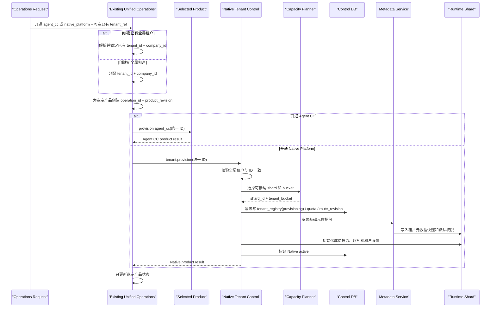
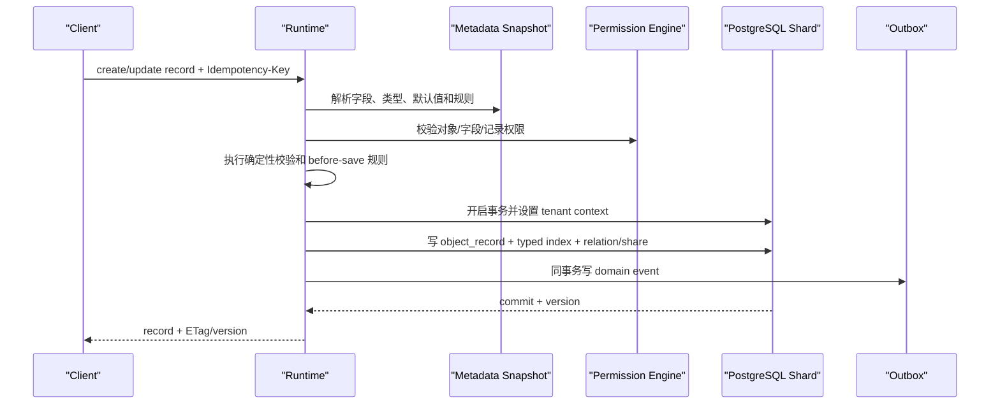
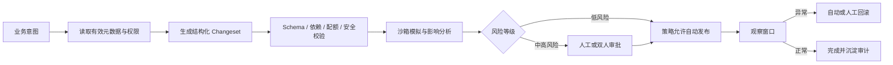

# FEAT-009 - CloudCC Semattice 多租户业务数据与语义运行时详细设计

## 0. 文档说明

### 0.1 文档目的

本文定义一个全新的企业级多租户、Agent Native 业务数据与运行时平台，作为后续产品规划、技术选型、系统拆分、数据建模、API 设计和研发实施的共同基线。CRM 是首批可安装的业务领域包，不是平台内核的唯一或先决实现。

产品正式名称为 **CloudCC Semattice（语义格）**，类别为 **Agentic Business Data Runtime**，中文定位为“面向智能体的业务数据与语义运行底座”。`Semattice` 由 `Sema(ntic) + (La)ttice` 组合而成；详细命名及兼容边界以 ADR-012 为准。本文保留的 `Native Platform` 和协议值 `native_platform` 均指 CloudCC Semattice，不表示另一个产品，也不授权直接重命名现有接口、二进制、环境变量或 Go module path。

目标产品保持成熟 CRM 平台的核心业务能力，同时从底层解决以下结构性问题：

1. 每租户独立数据库导致开户、升级、运维和资源利用成本过高。
2. 自定义对象依赖预制表和预制字段，扩展数量受物理表结构限制。
3. 大量宽表、无差别索引和混合负载导致查询、写入和变更性能不稳定。
4. 开放式触发器和类代码可以直接影响事务与数据库，破坏平台稳定性。
5. 元数据和平台能力必须可被 Agent 发现、执行、控制和审计，而不能依赖人工页面或彼此漂移的多套工具实现。

### 0.1.1 已确认产品边界

- 平台的首要价值是原生、可扩展地承载客户业务系统的数据，而不是先汇聚外部系统数据；即使没有任何外部连接器，客户也能在已发布元数据上构建和存储自己的业务对象、字段、关系和记录。
- 平台不是以跨系统 Golden Record、去重合并和数据分发为首要目标的传统 MDM。未来可把此类能力做成领域包或连接器能力，但不得以此替代原生事务数据底座。
- 平台内核先交付通用业务数据运行时、语义元数据、Changeset、权限、审计和 Agent 能力闭环；客户、销售、服务等 CRM 功能以领域包验证内核，不得抢在内核验证前成为首批实现重心。
- “Agent 控制”指 Agent 能在受限能力范围内发现、理解、提案和执行操作；模型不是数据、权限或发布的最终权威。确定性策略、审批和审计必须能拒绝或回滚高风险动作。

### 0.2 绿地前提

本文采用纯绿地设计，明确不承担以下约束：

- 不迁移 Agent CC 的历史业务数据；既有租户身份可按统一运营控制面的受控流程回填 `tenant_id`，并在明确需要时按需开通 Native Platform，这不等同于业务数据迁移。
- 不兼容旧数据库表、旧字段槽位、旧 `dbindex`、旧 ID 格式和旧 SQL 方言。
- 不兼容旧 API、旧前端、旧触发器、旧类代码和旧插件包。
- 不要求与旧平台双写、灰度切换或并行运行。
- 现有 CloudCC 代码仅用于识别业务能力、典型场景和风险，不作为新产品实现边界。

### 0.3 文档状态

- 当前状态：`approved`；用户于 2026-07-18 正式批准其作为 Phase 0/1 架构与实施基线。
- 本文是目标架构和实施基线，不代表相关代码、压测或生产运行已经完成。
- 关键容量数字是初始设计目标，最终值必须通过基准测试和试运行校准。
- 第 24 节的后置组件选型继续通过独立 ADR 决策，不阻塞 Phase 0 核心数据底座编码。

## 1. 产品目标与范围

### 1.1 产品定位

目标产品是一套面向中大型企业的纯 AI Native 多租户业务数据与运行时平台。它以版本化元数据定义对象、字段、关系、语义、权限和能力，以原生事务数据面存储客户业务数据；CRM、项目交付、服务管理等业务系统通过领域包构建在同一内核之上。平台不提供 Web、移动端、BFF 或人工交互式控制台；所有业务、配置和运维均由 Agent 通过三种等价入口执行：功能 API、MCP 服务和非交互式 CLI。

AI 不是附加聊天窗口，而是主要操作主体；确定性策略和授权系统保留对 Agent 行动的最终约束。每个已发布原子能力必须从统一 Capability Contract 派生 API、MCP Tool 和 CLI，三者共享元数据模型、权限模型、校验器、发布器、审计、回滚、幂等和错误语义。

### 1.2 平台内核与业务能力范围

Phase 0 和 Phase 1 先验证平台内核。领域包只用于证明通用内核能够承载真实业务，不构成“先完成全量 CRM”的承诺。

| 能力域 | 平台内核或领域包能力 |
|---|---|
| 原生业务数据运行时 | 不改业务表 DDL 的对象、字段、记录、关系、事务、查询、索引、事件、归档和审计 |
| 语义元数据 | 业务定义、同义词、单位、枚举含义、关系、生命周期、数据分类、负责人、质量规则和 Agent 使用策略 |
| 低代码配置 | 对象、字段、关系、查询模板、公式、验证规则、流程、审批和版本发布 |
| 权限与共享 | 用户、角色、组织树、权限集、字段权限、记录共享、团队和区域 |
| Agent 操作接口 | 功能 API、MCP 服务、非交互式 CLI、Capability Contract、批量 API、Webhook、连接器和事件订阅 |
| 平台运营 | 把既有 Agent CC 运营管理端扩展为产品无关的统一租户控制面；Agent CC 与 Native 可单独或按任意顺序开通，绑定时归属同一全局租户 |
| 领域包 | 客户与联系人、销售、市场、服务、协作等可安装业务对象、流程和映射模板 |

### 1.3 非目标

- V1 不提供允许租户上传任意 JVM 类、数据库触发器或原生二进制插件的能力。
- V1 不把全文搜索、复杂报表和跨租户运营分析放在 PostgreSQL OLTP 主库执行。
- V1 不追求把所有领域拆成独立微服务；优先保证事务边界清晰和模块可演进。
- 不依赖单个超大数据库实例解决平台增长问题。
- V1 不提供 Web、移动端、BFF、人工交互式管理页面或带菜单/提示的 CLI。
- 不先实现完整 CRM 模块群来替代平台内核验证；CRM 仅作为首批领域包和验收场景。
- 不把外部系统接入、Golden Record、跨源匹配/合并或主数据分发作为首期必要前提。
- 不通过直接共享或读写 Agent CC 用户数据库实现单点登录；共享身份必须经受众受限的联邦协议完成。

### 1.4 成功标准

| 维度 | 目标 |
|---|---|
| 开户 | 新租户开户不执行建库、建 schema、建分区 DDL，目标 2 分钟内可用 |
| 租户一致性 | 开通任一首个产品时统一分配 `UUIDv4 tenant_id + 20 位 company_id`；另一产品可不开放或以后绑定，绑定时必须复用同一标识；每个全局租户对每个产品最多一个投影 |
| 隔离 | 所有租户数据访问都由服务端租户上下文和数据库 RLS 双重约束 |
| 扩展 | 新增对象和普通字段不修改业务表 DDL，不受预制列数量限制 |
| 稳定性 | 自定义逻辑不得直接访问数据库、线程、文件系统或任意网络 |
| AI 治理 | 100% 元数据写操作通过 Changeset，可预检、审批、审计和回滚 |
| 扩容 | 单分片达到容量水位后可增加新物理实例，业务 API 与租户使用方式不变 |
| 数据规模 | 平台通过多分片支撑十亿至百亿级记录，不以单表单实例承载全部数据 |
| 可观测性 | 请求、事件、自动化和 Agent 操作可按租户、分片、版本和执行者追踪 |
| 三入口一致性 | 每个已发布原子能力都可经 API、MCP Tool 和非交互式 CLI 等价执行，并通过契约测试 |
| 语义可靠性 | Agent 对已发布对象、字段和关系只从版本化语义快照读取含义，并返回数据与元数据版本证据 |
| 业务承载 | 无外部数据源时，客户可在已发布元数据上创建、存储、查询和治理自身业务数据 |

## 2. 核心架构原则

1. **逻辑 OneDatabase，物理多分片**：产品模型统一，存储实例可横向增加。
2. **统一租户身份、显式数据路由**：既有运营控制面是 `tenant_id + company_id` 和全局生命周期的唯一事实源；Native 的 `tenant_id -> shard_id + tenant_bucket` 是数据落点的唯一事实源。
3. **元数据与能力契约即产品协议**：API、MCP、CLI、校验、权限、流程和 Agent 都消费同一版本化定义。
4. **记录与索引分离**：JSONB 保存权威记录，类型化索引只为可查询字段服务。
5. **事务与分析分离**：OLTP、搜索、分析、审计和文件按负载选择存储。
6. **配置即版本**：任何元数据变更都有草稿、差异、校验、发布和回滚。
7. **最小能力扩展**：自定义逻辑按声明式规则、流程、表达式、沙箱函数逐级开放。
8. **默认拒绝**：无租户上下文、无权限、无声明能力或无资源预算的操作直接失败。
9. **异步优先但边界明确**：核心记录事务强一致，搜索、分析、通知和外部集成最终一致。
10. **先模块化再服务化**：按领域边界组织代码，仅在隔离、伸缩或发布独立性有收益时拆服务。
11. **三入口同源**：任何已发布原子能力都必须以统一契约提供 API、MCP Tool 和非交互式 CLI；适配层不得复制业务语义。

## 3. 总体架构



### 3.1 平台分层

| 平面 | 主要职责 | 核心状态 |
|---|---|---|
| Unified Tenant Operations Control Plane | 全局 `tenant_id/company_id`、租户生命周期、Agent CC/Native 独立产品开通与状态汇总 | 由既有 Agent CC 运营管理端扩展；本仓库通过版本化接口接入 |
| Native Tenant & Shard Control Plane | Native 产品侧生命周期投影、分片注册、放置、路由、配额 | Native 控制面 PostgreSQL |
| Metadata Control Plane | 对象、字段、查询模板、权限、规则、版本、发布 | 元数据 PostgreSQL + 缓存 |
| Runtime Data Plane | 原生业务记录、关系、共享、事务查询 | 分片 PostgreSQL |
| AI Control Plane | 意图解释、配置计划、影响分析、Agent 工具治理 | 计划、策略、审计、知识图谱 |
| Automation & Extension Plane | 规则、流程、审批、调度、沙箱函数 | 执行定义、任务和日志 |
| Event & Integration Plane | 领域事件、Webhook、连接器、批量任务 | Event Bus + 投递状态 |
| Search & Analytics Plane | 全文检索、复杂筛选、报表、指标 | OpenSearch + OLAP |
| Security & Governance Plane | 身份、权限、共享、密钥、审计、合规 | IAM + Policy + Audit |
| Observability & Operations Plane | SLO、容量、成本、告警、故障处置 | Metrics/Logs/Traces |

### 3.2 推荐部署单元

初期建议形成以下可独立部署单元，内部继续保持清晰模块边界：

| 部署单元 | 包含模块 | 拆分理由 |
|---|---|---|
| `capability-gateway` | 功能 API、限流、版本与契约执行 | 统一 Agent 入口与安全边界 |
| `identity-service` | 登录、OIDC、会话、用户与服务身份 | 安全和可用性独立 |
| `tenant-control-service` | 接收统一运营端编排、维护产品侧生命周期、套餐/配额投影、分片和路由 | 全局租户目录在既有运营端；Native 控制面独立于租户数据面 |
| `metadata-service` | 元数据、Changeset、编译、发布、依赖图 | 配置生命周期一致 |
| `runtime-service` | 记录、关系、查询、权限、共享、审计入口 | 保持核心写事务完整 |
| `automation-service` | 规则编排、审批、调度、执行协调 | 可按任务量独立扩展 |
| `worker-service` | 索引、通知、导入导出、Webhook、连接器 | 异步负载隔离 |
| `search-service` | 索引编排和搜索 API | 与搜索引擎生命周期绑定 |
| `analytics-service` | 报表语义、查询编排、导出 | 与 OLAP 负载隔离 |
| `file-service` | 文件元数据、上传、下载、预览、病毒扫描 | 大文件和对象存储隔离 |
| `ai-control-service` | Agent 工具、规划、影响分析、策略协调 | AI 预算和风险独立治理 |
| `mcp-service` | MCP Tool 发现、schema 投影与调用适配 | 以 Capability Contract 暴露 Agent 工具 |
| `agent-cli` | 非交互式 CLI、JSON/JSON Lines 适配 | 本地 Agent、自动化和离线运维调用 |

不建议在首个版本把每个 CRM 对象拆成一个微服务。对象、字段、权限和记录写入高度依赖同一事务语义，过早拆分会把内部一致性问题放大为分布式事务问题。

## 4. 全局标识与上下文

### 4.1 标识规范

| 标识 | 说明 | 建议格式 |
|---|---|---|
| `tenant_id` | 两个平台统一的内部租户主键，由既有运营控制面唯一分配 | 随机 UUIDv4，不编码时间或分片位置 |
| `company_id` | 与 `tenant_id` 一对一的运营和 Agent CC 业务编号 | 20 位字符串；新 ID 延续 `org` + 17 位小写字母数字约定 |
| `shard_id` | 物理分片逻辑编号 | 短字符串，如 `shard-001` |
| `tenant_bucket` | 分片内物理分区号 | `smallint`，范围 `0..127` |
| `object_id` | 对象定义稳定 ID | UUIDv7 |
| `field_id` | 字段定义稳定 ID | UUIDv7 |
| `record_id` | 记录全局唯一 ID | UUIDv7 |
| `metadata_version_id` | 已发布元数据版本 | UUIDv7 |
| `changeset_id` | 一次原子配置变更 | UUIDv7 |
| `automation_id` | 自动化定义 | UUIDv7 |
| `execution_id` | 自动化或 Agent 执行 | UUIDv7 |
| `request_id` / `trace_id` | 请求与链路追踪 | 标准 trace ID |

ID 只保证唯一性，不编码物理分片位置。租户路由始终从受控路由表获得，避免未来调整分片时重写业务 ID。

租户创建是低频操作，`tenant_id` 选择随机 UUIDv4，以不可枚举、跨环境无需协调序列和错误值通常无法命中有效租户为优先；记录、元数据和执行 ID 属于高频写入，继续使用大致时间有序的 UUIDv7。UUID 不承担授权职责，所有租户数据隔离仍必须经过受信上下文、RLS 和同租户关系约束。

### 4.2 租户上下文

```text
TenantContext
  tenant_id
  company_id
  shard_id
  tenant_bucket
  user_id / service_principal_id / agent_id
  session_id
  metadata_version_id
  locale / timezone
  request_id / trace_id
  permission_snapshot_id
```

约束：

- 外部请求可以携带租户域名、`company_id` 或 token 作为解析线索，但 body/header 中的 `tenant_id` 不能直接成为受信上下文，也不能自行指定 `shard_id` 和 `tenant_bucket`。
- 网关从已验证令牌、统一运营租户事实和 Native active 投影解析唯一 `tenant_id/company_id`，再签发内部上下文；下游服务校验签名、受众和二者一致性。
- MQ、定时任务、批量任务必须在消息信封中显式携带租户上下文和版本。
- 数据库事务使用 `SET LOCAL app.tenant_id` 与 `app.tenant_bucket`，PostgreSQL RLS 进行最后一道隔离；连接复用前必须证明上下文不会残留。

### 4.3 统一租户运营、Agent CC 身份和独立数据授权

Agent CC 与 Native Platform 是两个可独立开通的产品，职责不同且没有固定先后。既有运营管理端升级为产品无关的统一租户运营控制面，负责全局租户目录、产品订阅和生命周期；共享身份中心或企业 IdP 负责账号认证；Native Platform 独立负责业务数据授权和数据落点。三个事实源不能合并为共享数据库写入。

| 层次 | 事实源与责任 |
|---|---|
| 全局租户目录 | 运营管理端在开通任一首个产品时创建或解析全局租户，分配随机 UUIDv4 `tenant_id` 与一对一 20 位 `company_id`，并独立维护 `agent_cc/native_platform` 产品状态；两个产品不得自行生成或替换租户 ID。 |
| 认证 | 当前 Agent CC 身份中心或其配置的企业 IdP 可继续负责账号、登录、SSO、MFA、全局 `subject_id` 和组织成员状态，但身份能力必须独立于 Agent CC 产品订阅，支持 Native-only 租户；Native Platform 只验证面向自身受众的短期令牌。 |
| Native 租户投影 | Native Platform 按运营控制面的幂等指令建立 `tenant_registry`，直接使用统一 UUID，维护 shard、bucket、配额、路由版本和产品侧生命周期；不再建立第二套组织到租户映射。 |
| 本地成员投影 | 数据平台可按登录即时创建或通过受控生命周期事件同步最小成员投影，用于停用、审计和本地授权；不得成为密码、凭据或用户资料的第二事实源。 |
| 数据授权 | 对象、字段、记录、共享、元数据发布和 Capability scope 均由数据平台独立计算；Agent CC 的普通应用角色不能自动扩大数据权限。 |
| Agent 委托 | Agent 与服务账号使用独立主体和短期 scope。代表用户运行时必须记录 `delegated_by_subject_id`、能力范围、资源范围、预算、会话和策略版本。 |
| 审计 | 运营控制面和两个产品分别保存审计记录，并用 `subject_id`、`tenant_id`、`company_id`、`operation_id`、请求 ID 和委托链关联；不得复制长期 token 或明文凭据。 |

令牌和内部上下文至少携带：`subject_id`、统一 `tenant_id`、`company_id`、`actor_type`（human/agent/service）、面向数据平台的 audience、有效期、会话与请求 ID，以及必要的 delegated-by 和 membership/policy version。数据平台必须验证 `tenant_id/company_id` 与本地 active 投影一致，并校验签发者、受众、有效期、撤销或成员状态后，再执行本地数据权限计算。

统一标识不等于共享数据库或共享权限。详细所有权、编排、迁移和验收规则见 `docs/specs/FEAT-011-unified-tenant-operations-control-plane.md`。

## 5. 多租户与物理分片设计

### 5.1 逻辑模型

对产品和业务开发者而言，所有租户使用同一套数据模型和 API；对平台而言，租户被放置到多个规格受限的 PostgreSQL 分片中。

```text
tenant_id
  -> tenant_registry
  -> shard_id + tenant_bucket + route_revision
  -> shard connection pool
  -> LIST partition tenant_bucket
  -> tenant_id / object_id / record_id predicate
```

每个生产分片实例以 `16 vCPU / 64 GB RAM` 为单节点规格上限。扩容的主要方式是新增分片实例，不依赖持续提升单机规格。

### 5.1.1 已接受的 Phase 0 PostgreSQL 基线

Phase 0 使用 Docker PostgreSQL `16.13`（`postgres:16` 的已验证镜像 ID 见 ADR-008），以单可用区、单 writer 验证 128 bucket、RLS、连接池上下文、`object_record` 与类型索引。该环境明确不含 HA、持续 WAL 归档、备份或恢复演练。

容量 PoC 必须在 8 GiB 与 16 GiB Docker 内存上限下分别运行，目标为 50 个并发请求、200 名活跃用户和 1,000,000 条业务记录；普通读取和写入仍分别以 P95 300 ms / 500 ms 为目标。基准 manifest 必须冻结 CPU、卷/IOPS、数据库参数、记录形状、读写比例和热租户分布，不能把“类似规模系统”作为未测量的替代证据。

### 5.2 控制面核心表

```sql
create table shard_registry (
  shard_id              varchar(32) primary key,
  region                varchar(32) not null,
  status                varchar(20) not null,
  writer_endpoint_ref   varchar(128) not null,
  reader_endpoint_ref   varchar(128),
  capacity_class        varchar(32) not null,
  admission_enabled     boolean not null default true,
  route_revision        bigint not null,
  created_at            timestamptz not null,
  updated_at            timestamptz not null
);

create table tenant_registry (
  tenant_id             uuid primary key,
  company_id                varchar(20) collate "C" not null unique,
  display_name          varchar(200) not null,
  shard_id              varchar(32) not null references shard_registry(shard_id),
  tenant_bucket         smallint not null check (tenant_bucket between 0 and 127),
  service_tier          varchar(24) not null,
  global_lifecycle_status varchar(24) not null,
  native_status         varchar(24) not null,
  tenant_revision       bigint not null,
  product_revision      bigint not null,
  route_revision        bigint not null,
  metadata_version_id   uuid,
  created_at            timestamptz not null,
  updated_at            timestamptz not null,
  unique (shard_id, tenant_bucket, tenant_id)
);

create table bucket_capacity (
  shard_id              varchar(32) not null,
  tenant_bucket         smallint not null,
  tenant_count          integer not null,
  logical_bytes         bigint not null,
  record_count          bigint not null,
  write_qps_5m          numeric(18,2) not null,
  read_qps_5m           numeric(18,2) not null,
  hotness_score         numeric(18,4) not null,
  updated_at            timestamptz not null,
  primary key (shard_id, tenant_bucket)
);
```

连接地址保存为密钥或配置引用，不在普通 API 和日志中返回数据库密码。

### 5.3 128 个租户桶

128 是单个数据库分片内的固定分区数量，不是整个平台的上限。

- `shard-001` 有 bucket `0..127`。
- `shard-002` 也有独立的 bucket `0..127`。
- 平台物理分区组总数为 `shard_count * 128`。
- 新增分片时，不需要修改已有分片的 128 个桶，也不需要执行全量 rehash。

推荐在初始化一个新分片时一次性创建 128 个 `LIST (tenant_bucket)` 分区。开户时只写 `tenant_registry` 和租户初始化数据，不执行数据库 DDL。

不直接使用 `hash(tenant_id) % 128` 作为唯一放置策略。`tenant_bucket` 由控制面选择并持久化，便于根据租户体量、热点和套餐做均衡；同一租户在一次路由调整前始终落在一个 bucket 中。

### 5.4 产品独立开户与统一租户绑定流程



运营控制面是 `tenant_id`、`company_id`、全局生命周期和按产品开通状态的唯一写入方。Agent CC-only、Native-only 和双产品租户都合法，两个产品没有固定开通顺序。开通第二个产品并要求绑定时必须选择已有全局租户；若两个产品已经以不同 `tenant_id` 独立运行，禁止直接改映射，必须进入独立合并/迁移流程。任一产品开通使用自己的 `operation_id` 和产品修订号，失败不回滚另一个产品，也不生成第二组 ID。

放置算法按以下顺序筛选：

1. 区域、合规域、套餐和可用区满足要求。
2. 分片 `admission_enabled=true`，近期无维护或迁移。
3. CPU、连接、存储、WAL、延迟和 90 天增长预测未超过准入水位。
4. 在候选分片中按加权容量分数选择。
5. 在分片内部选择 `hotness_score` 最低且租户数量合理的 bucket。
6. 大客户可直接进入 `large_shared` 或 `dedicated_shard` 服务等级。

### 5.5 运行时路由

- L1：进程内短 TTL 路由缓存，键为 `tenant_id`。
- L2：Redis 路由缓存，保存 `shard_id`、`tenant_bucket`、`route_revision`。
- L3：控制面数据库是最终事实源。
- 路由变更通过事件广播；请求发现版本过旧时主动刷新。
- 每个服务按 `shard_id` 管理连接池，不按租户创建连接池。
- 一个事务不能跨租户或跨分片；跨租户运营任务走异步编排和分析平面。

### 5.6 横向扩容和租户再平衡

扩容流程：

1. 生产阶段部署新的 PostgreSQL HA 分片并创建标准 schema 与 128 个分区；Phase 0 只使用单可用区单 writer Docker PoC。
2. 注册到 `shard_registry`，完成探活、备份、压测和故障切换验收。
3. 开启 `admission_enabled`，新开户优先进入新分片。
4. 如需释放热点分片，按租户做快照复制、增量追平、短暂停写和路由切换。
5. 路由切换以 `route_revision` 为 fencing token，防止旧实例继续写旧分片。

这里的租户搬迁是新平台内部持续运维能力，不是旧系统历史迁移兼容。

### 5.7 容量准入与分片水位

分片不按 PostgreSQL 理论最大表大小运营，而按可验证的性能和恢复目标运营。初始准入建议：

| 指标 | 停止普通开户的建议水位 | 说明 |
|---|---:|---|
| 持续 CPU | 60% | 保留突发和故障切换余量 |
| 数据盘使用率 | 65% | 包含索引、膨胀、WAL 和维护空间 |
| 活跃连接槽位 | 70% | 连接池需有硬上限 |
| 复制延迟 | 超过 SLO | 暂停接纳并排查 |
| 90 天预测容量 | 75% | 提前扩容，不等当前资源耗尽 |
| 单租户热度 | 超过共享阈值 | 转 large_shared 或 dedicated |

“每分片多少行”只作为估算，不作为唯一水位。建议首轮压测以每分片 2 亿业务记录为基线，测量真实记录宽度、类型索引放大、列表查询、写入和备份恢复后再提高或降低。若全平台达到 100 亿记录，以平均每分片 2 亿记录估算约需 50 个分片；这只是规划样例，不是固定容量承诺。

## 6. 元数据内核设计

### 6.1 元数据职责

元数据不仅描述数据库字段，还应完整描述业务语义和运行行为：

- 对象、字段、关系、枚举和记录类型。
- 查询模板、搜索模板、动作和机器可读操作描述。
- 公式、验证规则、默认值、自动编号和派生字段。
- 对象权限、字段权限、共享策略和审批权限。
- 流程、审批、定时任务、通知和集成映射。
- 报表语义、指标、数据分类、保留策略和 AI 使用策略。

### 6.2 核心元数据模型

| 实体 | 关键字段 | 说明 |
|---|---|---|
| `metadata_package` | package_key, version, dependency | CRM 基础包、行业包、租户包 |
| `object_def` | object_id, api_name, label, lifecycle | 对象定义 |
| `field_def` | field_id, object_id, type, semantic | 字段定义 |
| `relation_def` | relation_id, source, target, cardinality | 查找、主从、多对多 |
| `record_type_def` | record_type_id, object_id, process | 记录类型与过程 |
| `query_template_def` | template_id, object_id, query, columns, sort | 供 Agent 调用的已保存查询模板 |
| `capability_def` | capability_id, action, input_schema, output_schema, policy | API/MCP/CLI 的原子能力契约 |
| `validation_rule_def` | expression, error_path, severity | 验证规则 |
| `formula_def` | expression, return_type, dependencies | 公式字段 |
| `permission_def` | principal, resource, actions, effect | 权限声明 |
| `sharing_rule_def` | source_scope, target_group, access | 记录共享规则 |
| `automation_def` | trigger, condition, graph, limits | 自动化定义 |
| `report_model_def` | dimensions, measures, joins | 报表语义模型 |
| `metadata_node` | node_id, type, ref_id | 依赖图节点 |
| `metadata_edge` | from_node, to_node, edge_type | 引用和影响关系 |

所有租户自定义元数据都带 `tenant_id`；平台内置元数据位于不可变基础包，通过 package dependency 合成租户有效模型。

### 6.3 字段定义

```json
{
  "apiName": "annualRevenue",
  "label": "年营业额",
  "businessMeaning": "客户最近一个财年的确认营业收入",
  "dataType": "decimal",
  "precision": 20,
  "scale": 2,
  "required": false,
  "queryPolicy": "indexed",
  "filterOperators": ["eq", "gt", "gte", "lt", "lte", "between"],
  "classification": "confidential",
  "maskingPolicy": "finance_default",
  "aiPolicy": {
    "readable": true,
    "writable": false,
    "explainBeforeUse": true
  },
  "validation": {
    "min": 0
  },
  "riskLevel": "medium",
  "ownerTeam": "crm-platform"
}
```

字段类型至少覆盖：文本、长文本、富文本、整数、小数、金额、百分比、布尔、日期、时间、日期时间、单选、多选、邮箱、电话、URL、地址、地理位置、文件、图片、查找关系、主从关系、多对多、自动编号、公式、汇总和加密字段。

### 6.4 元数据生命周期

```text
draft
  -> validate
  -> simulate
  -> approval_required / ready
  -> publish
  -> observe
  -> superseded / rollback
```

- `draft` 可反复修改，不影响运行租户。
- `validate` 检查名称、类型、依赖、权限、表达式、配额和兼容规则。
- `simulate` 在沙箱数据或结构样本上生成影响报告和执行计划。
- `publish` 原子生成新的 `metadata_version_id`。
- 运行请求固定读取一个已发布版本，避免一次请求中配置漂移。
- 回滚发布新的反向版本，不原地篡改历史版本。

### 6.5 Changeset

```json
{
  "changesetId": "019...",
  "tenantId": "019...",
  "baseVersion": "019...",
  "intent": "为商机增加预计回款日期，并允许 Agent 在查询结果中取得该字段",
  "operations": [
    {
      "op": "metadata.field.create",
      "object": "Opportunity",
      "payload": {
        "apiName": "expectedPaymentDate",
        "label": "预计回款日期",
        "dataType": "date",
        "queryPolicy": "indexed"
      }
    }
  ],
  "riskLevel": "medium",
  "requestedBy": {
    "type": "agent",
    "id": "sales-config-agent"
  }
}
```

Changeset 必须具备：基础版本、结构化操作、前置条件、幂等键、影响范围、风险等级、审批策略、执行结果、审计记录和自动生成的回滚计划。

### 6.6 元数据编译与缓存

发布器将人类友好的定义编译为运行时快照：

- 对象和字段字典。
- 校验和公式执行计划。
- 权限决策计划。
- 查询字段映射与索引策略。
- Capability Contract、API 路由、MCP Tool 描述和 CLI 命令 schema。
- 自动化触发索引。
- Agent 工具描述和 JSON Schema。

运行时按 `tenant_id + metadata_version_id` 缓存编译结果。发布事件触发预热；旧版本在活动请求结束和保留窗口后淘汰。

## 7. 元数据驱动对象存储

### 7.1 存储分层

| 层 | 作用 | 一致性 |
|---|---|---|
| `object_record` | 记录权威值、版本、所有者和生命周期 | 强一致 |
| 类型化索引表 | 动态字段等值、范围、排序和关联查询 | 与记录同事务 |
| 关系与共享表 | 关系边、团队、显式共享 | 与记录同事务或受控异步 |
| 搜索索引 | 全文、模糊、跨字段搜索 | 最终一致 |
| 查询投影 | 高热对象和固定运营视图 | 可重建，秒级最终一致 |
| OLAP 明细与聚合 | 复杂报表、趋势和跨对象分析 | 分钟级最终一致 |
| 审计与归档 | 变更历史、合规保留、冷数据 | 追加写 |

### 7.2 `object_record`

```sql
create table object_record (
  tenant_bucket       smallint not null,
  tenant_id           uuid not null,
  object_id           uuid not null,
  record_id           uuid not null,
  record_type_id      uuid,
  owner_id            uuid,
  record_number       varchar(80),
  lifecycle_state     varchar(20) not null default 'active',
  data                jsonb not null,
  version             bigint not null,
  created_by          uuid not null,
  created_at          timestamptz not null,
  updated_by          uuid not null,
  updated_at          timestamptz not null,
  deleted_at          timestamptz,
  primary key (tenant_bucket, tenant_id, object_id, record_id)
) partition by list (tenant_bucket);
```

每个分片预建 `object_record_p000` 到 `object_record_p127`。核心索引建议：

```sql
create index on object_record_p000
  (tenant_id, object_id, updated_at desc, record_id)
  where lifecycle_state = 'active';

create index on object_record_p000
  (tenant_id, object_id, owner_id, updated_at desc)
  where lifecycle_state = 'active';
```

不对 `data` 创建一个覆盖所有 JSONB 键的通用 GIN 索引。通用 GIN 在字段多、写入频繁和租户差异大时会产生明显索引膨胀，且难以保证排序和范围查询质量。

### 7.3 类型化动态索引

只有 `queryPolicy=indexed|unique|reference|fulltext` 的字段才生成索引记录，避免把每个 JSON 值复制成完整 EAV 数据集。

```sql
create table record_index_number (
  tenant_bucket smallint not null,
  tenant_id     uuid not null,
  object_id     uuid not null,
  field_id      uuid not null,
  record_id     uuid not null,
  value_number  numeric(38, 12) not null,
  primary key (tenant_bucket, tenant_id, object_id, field_id, record_id)
) partition by list (tenant_bucket);

create index on record_index_number_p000
  (tenant_id, object_id, field_id, value_number, record_id);
```

同类表包括：

- `record_index_text`：规范化文本、精确匹配、前缀匹配和唯一约束辅助。
- `record_index_number`：整数、小数、金额、百分比。
- `record_index_datetime`：日期、时间和日期时间。
- `record_index_reference`：查找和主从关系目标。
- `record_index_choice`：单选和多选值。
- `record_geo_index`：地理位置，使用 PostGIS 时按空间类型设计。

字段创建默认 `queryPolicy=none` 或由产品模板指定。用户把字段加入筛选、排序、唯一约束或高频列表时，平台评估并创建后台索引任务；任务完成前查询器可拒绝高成本操作或受限降级，不静默执行全表扫描。

#### 7.3.1 动态字段与 JSONB 产品边界

PostgreSQL JSONB/TOAST 的理论单值上限不能作为 OLTP 产品配额。Phase 0/1 先采用以下保守护栏，最终由 `TASK-019` 在 8 GiB/16 GiB、50 并发、200 活跃用户和 100 万记录条件下校准：

| 维度 | 默认/目标 | 硬边界 |
|---|---:|---:|
| 每对象在线动态字段定义 | 300 | 500 |
| 8 GiB 档 active 类型化索引字段 | 10 | 20 |
| 16 GiB 档 active 类型化索引字段 | 20 | 40 |
| 平台 active 类型化索引字段绝对上限 | - | 50，且仅限专属分片与专项压测批准 |
| 单条记录规范化业务 JSON | 平均不超过 4 KiB，P95 不超过 16 KiB | 64 KiB 告警，超过 256 KiB 拒绝 |
| 单个 `json` 字段 | 建议不超过 16 KiB | 64 KiB |
| JSON 嵌套深度/单数组元素数 | 4 层/100 | 8 层/1,000 |

500 是字段定义数量上限，不是“500 个字段都可建索引”的承诺。`TASK-015` 的百万记录实测表明两个 typed index tree 合计 `737,198,080` bytes，平均每个“记录 × 索引字段”约 `368.60` bytes；按同一数据形状估算，20/40/50 个满覆盖索引字段仅 typed trees 就约为 `7.37/14.74/18.43 GB`，尚不包含权威记录、关系、唯一值、WAL、膨胀和维护空间。

在线字段计数包含 `active`、`deprecated` 和 `purging`，完成数据清理并只保留审计 tombstone 后才释放名额。记录尺寸按服务端应用默认值并规范化后的 UTF-8 JSON 字节数计算；文件、图片、富文本附件和二进制必须存外部对象引用，禁止以 Base64 内联到 JSONB。

#### 7.3.2 动态字段安全演进

- 首次发布后 `field_id` 和 `api_name` 不可变；显示名与说明可以演进。技术改名或改类型必须创建新字段，经过转换/回填/切换后弃用旧字段。
- 新 optional 且无索引字段可以即时发布；默认值必须声明 `on_create` 或 `backfill_required`，不得把只作用于新记录的默认值误报为历史数据已回填。
- required 字段必须先以 optional 引入，完成 100% 回填和违规校验，再由下一元数据版本激活 required。
- 新 indexed/unique/reference 字段先进入 `building`，对新写维护派生状态并回填历史记录；完成 coverage 校验后才进入 `active`。查询规划器不得使用 building/failed 索引，不得返回部分结果或静默全表扫描。
- 删除依次经过 deprecated、read-only、hidden、purging、tombstone。运行时在清理完成前仍须识别旧 JSON key；清理必须覆盖权威 JSONB、typed index、关系、唯一值、搜索和 OLAP 派生副本。
- 回填按 tenant/bucket/object/record 稳定游标分批执行，使用 TenantContext、幂等 operation、checkpoint 和乐观版本检查；并发更新冲突必须重试，禁止覆盖用户新写。

详细状态机、Changeset 原子能力、覆盖率门禁和回滚边界见 [FEAT-014](./FEAT-014-changeset-and-dynamic-field-evolution.md)。

### 7.4 写入流程



更新使用乐观锁：客户端提交 `If-Match` 或 `version`，版本不匹配返回冲突，不做最后写入覆盖。

### 7.5 查询执行策略

查询规划器根据元数据和成本选择执行路径：

1. 核心字段查询直接使用 `object_record` 的结构化列。
2. 动态字段等值、范围和排序使用类型化索引表。
3. 低数据量且未索引字段只允许受限 JSONB 扫描，并设置行数与超时预算。
4. 全文和模糊搜索进入搜索平面。
5. 多对象大聚合、趋势和跨期报表进入 OLAP。
6. 高频固定列表可使用可重建查询投影。

示例查询 DSL：

```json
{
  "object": "Opportunity",
  "select": ["name", "stage", "amount", "owner.name"],
  "where": {
    "and": [
      {"field": "stage", "op": "in", "value": ["QUALIFIED", "PROPOSAL"]},
      {"field": "amount", "op": "gte", "value": 100000}
    ]
  },
  "orderBy": [{"field": "amount", "direction": "desc"}],
  "page": {"after": "opaque-cursor", "size": 50}
}
```

查询 DSL 必须经 AST 解析、字段权限检查、操作符白名单、成本估算和参数绑定，禁止客户端提交 SQL。

### 7.6 关系存储

- 单值查找：权威值保存在记录 JSONB，同时写 `record_index_reference`。
- 主从关系：关系定义包含级联删除、重新归属和汇总策略。
- 多对多关系：使用 `record_relation` 边表，不把 ID 数组作为唯一查询来源。
- 关系边始终包含 `tenant_id` 和两侧 `object_id`，不允许跨租户关系。
- 查找、主从和多对多边必须把同一个 `tenant_id` 同时绑定到 source 与 target；优先使用 `(tenant_bucket, tenant_id, object_id, record_id)` 复合外键，无法建立物理外键时必须执行等价的事务内确定性校验，禁止只按 `record_id` 查找目标。
- 级联操作按预算执行；超出同步阈值转为可恢复后台任务。

### 7.7 唯一性、自动编号和公式

- 租户内唯一字段由 `record_unique_value` 统一维护，唯一键包含 `tenant_id + object_id + field_id + normalized_hash`。
- 自动编号通过分片内租户序列表或号段服务生成，保证租户和对象范围内唯一。
- 公式在元数据发布时编译，读取时计算或在依赖字段变更时物化；策略由公式复杂度和查询需求决定。
- 汇总字段使用领域事件增量维护，并提供周期性重算校验。

### 7.8 删除、归档和保留

- 默认先软删除并进入租户回收站。
- 到期后由后台任务清理记录、类型索引、关系、共享、搜索和 OLAP 副本。
- 大体量历史活动、审计和事件按时间分区并归档到低成本存储。
- 删除流程有可观察状态和幂等检查，禁止同步请求执行无上限级联删除。

## 8. AI 原生元数据控制面

### 8.1 设计原则

Agent 只能通过平台公开的结构化工具读取和修改配置，不能直接写元数据表、执行 SQL、调用内部任意接口或绕过审批。

模型负责理解意图和提出计划；确定性平台负责权限校验、依赖分析、风险判定、执行、审计和回滚。安全决策不交给模型自由判断。

### 8.2 Agent 可理解性

每个元数据节点应包含：

- 稳定 API 名、显示名、业务含义和示例。
- 同义词、单位/币种、枚举业务含义、生命周期和质量规则，避免 Agent 仅凭物理字段名推断语义。
- 数据类型、约束、默认值和允许操作。
- 所属业务域、负责人、数据分类和合规标签。
- 上游依赖、下游使用方和运行热度。
- Agent 可读、可写、可用于推理、可用于外发的策略。
- 风险等级、审批要求、测试样例和弃用状态。

元数据依赖图支持回答“修改这个字段会影响什么”，并用于删除保护、变更排序、测试选择和回滚计划。

Agent 查询或写入前必须绑定到已发布的 `metadata_version_id`，只能通过该版本生成的查询计划和 Capability Contract 访问数据，不得自行猜测表、字段或 SQL。返回结果应携带对象/字段语义、数据版本、元数据版本和适用权限等证据，供上层 Agent 解释与复核。

### 8.3 Agent 工具协议

工具按资源和动作命名，使用 OpenAPI/JSON Schema 描述输入输出：

- `metadata.object.get/list/create/update/deprecate`
- `metadata.field.create/update/index/deprecate`
- `metadata.query_template.create/update/deprecate`
- `metadata.permission.grant/revoke`
- `metadata.automation.create/update/activate`
- `changeset.create/validate/simulate/submit/publish/rollback`
- `impact.analyze`
- `runtime.record.query/create/update`
- `report.run`

所有写工具默认生成 Changeset；只有发布器能把 Changeset 变成有效元数据版本。

### 8.3.1 Capability Contract、API、MCP 与 CLI

每个已发布原子能力以版本化 `capability_def` 作为唯一行为契约，至少定义：稳定能力 ID 与动作、输入/输出 JSON Schema、同步或异步语义、权限与风险策略、幂等要求、稳定错误码、审计事件及版本兼容规则。

该契约生成或校验三种等价入口：

| 入口 | 用途 | 强制约束 |
|---|---|---|
| 功能 API | 远程 Agent 编排和服务间调用 | 版本化端点、JSON payload、认证、幂等与稳定错误码 |
| MCP Service | Agent 的工具发现与结构化调用 | 每项能力有可发现 Tool、同一 input/output schema 与策略检查 |
| `agent-cli` | 本地 Agent、自动化和离线运维 | 无菜单、无提示、无交互状态；参数或 stdin JSON 输入，JSON/JSON Lines 输出 |

三入口在进入运行时前都标准化为同一个 capability invocation；运行时只执行一次权限、配额、风险、Changeset、审计和业务逻辑。异步能力返回统一的 `operation_id`，并通过 API、MCP 和 CLI 以同一状态模型查询。仅限内部实现细节可不暴露；任何对 Agent 发布的原子能力缺少其中任一入口即不得发布。

### 8.4 Agent 执行流程



### 8.5 Agent 身份与授权

| 身份 | 典型范围 | 默认限制 |
|---|---|---|
| `tenant_agent` | 单租户业务和配置 | 不能访问其他租户或平台路由 |
| `implementation_agent` | 租户元数据实施 | 不能读取业务敏感值，发布需审批 |
| `support_agent` | 诊断和只读分析 | 默认只读，敏感字段脱敏 |
| `platform_agent` | 平台模板和运营 | 高风险操作双人审批 |
| `system_job` | 确定性后台任务 | 仅固定能力和固定资源范围 |

Agent token 必须包含租户、能力 scope、资源范围、有效期、预算和会话 ID。禁止使用一个永久平台密钥让 Agent 跨租户操作。

### 8.6 风险分级

| 等级 | 示例 | 默认策略 |
|---|---|---|
| 低 | 新建未使用视图、修改帮助文本 | 可按租户策略自动发布 |
| 中 | 新建字段、修改查询模板、启用通知 | 预检后单人审批 |
| 高 | 删除字段、修改权限、启用自动化、外发数据 | 双人审批 + 观察窗口 |
| 禁止 | 直接 SQL、关闭审计、跨租户读写、提升自身权限 | 平台拒绝 |

### 8.7 可控制性和成本

- 每个 Agent 有调用次数、token、执行时间、数据行数和外部调用预算。
- 写操作必须有幂等键，重复提交返回原执行结果。
- Agent 读取大数据时先返回摘要和字段目录，再按权限分页获取。
- Prompt、工具调用、Changeset、审批和结果都进入不可抵赖审计链。
- 可一键暂停某 Agent、某工具、某租户 AI 能力或全平台自动发布。

## 9. 权限、共享与数据安全

### 9.1 权限决策链

权限默认拒绝，按以下顺序计算：

```text
账号与租户状态
  -> 套餐/许可证能力
  -> 对象级 CRUD 权限
  -> 字段级读写权限
  -> 记录级访问权限
  -> 动作和状态约束
  -> 数据脱敏与外发策略
  -> 最终允许字段集合和操作集合
```

任何一层拒绝都不能被下层放宽。返回记录前再次执行字段裁剪和脱敏，避免查询计划正确但序列化泄露字段。

### 9.2 授权模型

- RBAC：角色、Profile、Permission Set 和系统权限。
- ABAC：部门、区域、数据分类、记录状态、工作时间和设备风险等属性。
- ReBAC：负责人、团队、组织层级、区域层级、客户关系和显式共享。
- Policy：Agent、外部集成、导出、下载和敏感字段使用策略。

### 9.3 记录共享

核心实体：

| 表/模型 | 作用 |
|---|---|
| `principal` | 用户、用户组、角色节点、团队、Agent、服务身份 |
| `group_membership` | 组成员和角色层级闭包 |
| `record_owner` | 记录负责人和归属组织 |
| `record_team_member` | 销售/服务团队成员及访问级别 |
| `share_grant` | 手工、规则、审批、程序产生的显式授权 |
| `sharing_rule_def` | 条件共享和所有者共享定义 |
| `permission_snapshot` | 已编译权限版本和缓存失效依据 |

不为每个“用户 x 记录”组合都物化 ACL。采用混合计算：

- 负责人、本人创建、角色层级等常见路径直接用结构字段和成员闭包过滤。
- 团队和例外授权写 `share_grant`。
- 大范围规则优先授权给组或访问集合，不展开成海量用户记录对。
- 高热查询编译为权限谓词模板，并以 `permission_snapshot_id` 缓存。
- 角色和共享规则变化通过事件触发增量重算；大批量变化进入后台任务。

### 9.4 PostgreSQL RLS

RLS 负责租户隔离，不替代完整业务权限：

```sql
alter table object_record enable row level security;
alter table object_record force row level security;

create policy tenant_isolation on object_record
using (
  tenant_id = current_setting('app.tenant_id')::uuid
  and tenant_bucket = current_setting('app.tenant_bucket')::smallint
)
with check (
  tenant_id = current_setting('app.tenant_id')::uuid
  and tenant_bucket = current_setting('app.tenant_bucket')::smallint
);
```

- 应用运行账号不是表 owner，不具备 `BYPASSRLS`。
- 每个数据库操作都在显式事务中通过 `SET LOCAL` 注入已验证的 UUID `tenant_id` 和 bucket；缺少、格式错误或 registry 不匹配时 fail closed。
- 连接归还连接池前必须清理并验证 session context；复用连接和事务失败路径都要覆盖残留测试。
- 所有租户表启用并强制 RLS；迁移/维护账号与普通运行账号分离，跨租户运营能力使用独立受审计通道。
- 平台运营跨租户查询使用独立账号、独立 API 和强审计，不能复用普通业务连接。
- CI 中必须测试缺少上下文、伪造/错误 UUID、有效但不属于当前主体的 UUID、连接池上下文残留，以及查找/主从/多对多关系跨租户引用。

### 9.5 敏感数据

- 字段元数据声明 `public/internal/confidential/restricted` 分类。
- 加密字段使用信封加密，租户数据密钥由 KMS 托管并支持轮换。
- 可搜索敏感字段使用规范化哈希辅助精确匹配，不对明文建通用索引。
- API、日志、搜索、OLAP、导出和 Agent 工具分别执行数据最小化策略。
- 文件上传执行类型检查、病毒扫描、内容安全策略和短期签名 URL。

## 10. 自动化与受控扩展运行时

### 10.1 能力分级

| 等级 | 能力 | 适用场景 | 约束 |
|---|---|---|---|
| L1 | 验证规则和声明式动作 | 必填、字段更新、错误提示 | 确定性、同步、低成本 |
| L2 | 可视化流程 DAG | 分支、并行、等待、通知、子流程 | 节点和运行时有预算 |
| L3 | 类型安全表达式 | 公式、条件、映射 | 无 I/O、无副作用 |
| L4 | 沙箱函数 | 复杂计算和数据转换 | 能力授权、CPU/内存/时间限制 |
| L5 | 托管连接器/插件 | 外部系统和专用能力 | 签名包、隔离进程、平台审核 |

租户不能创建数据库触发器、上传任意 Java 类、打开线程、访问宿主文件系统或获取数据库连接。

### 10.2 记录事务内自动化

同步事务阶段只允许确定性、快速、可预算的操作：

1. `before_validate`：标准化输入、默认值和纯表达式计算。
2. `validate`：字段、对象和业务规则校验。
3. `before_save`：有限次字段赋值和同事务内受控关联写入。
4. `commit`：记录、类型索引、关系、必要共享和 outbox 原子提交。

约束：

- 同一记录同步自动化最大迭代次数可配置，默认不超过 5 次。
- 同步阶段禁止网络调用、长循环、休眠、批量扫描和跨分片事务。
- 超出预算立即失败并返回可解释错误，不让线程无限阻塞。
- 规则冲突、循环依赖和不可达分支在发布前由编译器发现。

### 10.3 事务后自动化

以下操作统一消费 outbox 事件：

- 通知、邮件、短信和协作消息。
- Webhook 和第三方连接器。
- 搜索索引和 OLAP 同步。
- 跨记录批量更新、汇总重算和共享重算。
- AI 推理、内容生成和外部数据增强。

每个执行有 `execution_id`、幂等键、重试策略、死信、补偿动作、资源用量和完整日志。

### 10.4 流程与审批

流程定义使用版本化 DAG；运行实例固定绑定定义版本，发布新版本不改变已运行实例。

审批核心模型：

- `approval_process_def`：适用对象、进入条件、版本。
- `approval_step_def`：审批人解析、并签/或签、超时和委托。
- `approval_instance`：记录、当前步骤、状态和定义版本。
- `approval_task`：待办、处理人、截止时间和结果。
- `approval_action_log`：提交、撤回、同意、拒绝和转交审计。

### 10.5 沙箱函数

推荐优先评估 WebAssembly 运行时；JavaScript 沙箱只作为开发体验层，最终仍需能力隔离。

默认限制建议：

| 资源 | 同步函数 | 异步函数 |
|---|---:|---:|
| CPU 时间 | 100 ms | 5 s，可按套餐调整 |
| 内存 | 32 MB | 128 MB |
| 输出 | 256 KB | 2 MB |
| 网络 | 禁止 | 仅经托管连接器白名单 |
| 数据访问 | 当前记录和显式工具 | 带权限的批量工具 |
| 重试 | 不自动重试 | 按幂等策略重试 |

沙箱函数发布前执行静态检查、依赖锁定、测试样例、签名和风险审批。运行时支持熔断、租户级并发限制和全局紧急停用。

## 11. 事件与集成平台

### 11.1 事件模型

事件统一使用不可变信封：

```json
{
  "eventId": "019...",
  "eventType": "crm.opportunity.updated.v1",
  "tenantId": "019...",
  "shardId": "shard-003",
  "aggregateType": "Opportunity",
  "aggregateId": "019...",
  "aggregateVersion": 18,
  "metadataVersionId": "019...",
  "occurredAt": "2026-07-13T08:00:00Z",
  "actor": {"type": "user", "id": "019..."},
  "traceId": "...",
  "data": {},
  "schemaVersion": 1
}
```

事件 schema 进入注册表并做兼容校验。事件只包含订阅方所需的最小信息；敏感字段默认不进入通用事件。

### 11.2 Transactional Outbox

- 业务记录和 `outbox_event` 在同一个 PostgreSQL 事务提交。
- Relay 使用 `FOR UPDATE SKIP LOCKED` 或 CDC 安全读取待发送事件。
- 发布至少一次，消费者必须按 `event_id` 幂等。
- Outbox 按时间分区并定期归档，不能无限累积在热表。
- 消息发送失败不回滚已成功的业务事务，但必须可告警、重试和补发。

### 11.3 开放 API

| API 类别 | 设计要求 |
|---|---|
| Record API | 标准 CRUD、批量、乐观锁、幂等键、字段权限 |
| Query API | 结构化 DSL、游标分页、成本限制、可解释执行路径 |
| Metadata API | 读已发布版本；写入统一生成 Changeset |
| Bulk API | 异步任务、分片上传、错误明细、断点和结果保留 |
| Event API | 订阅、过滤、重放窗口、签名和投递日志 |
| Agent Tool API | 能力描述、范围、预算、风险和审计 |
| MCP API | Tool 发现与调用；从 Capability Contract 投影，不拥有独立业务语义 |
| Agent CLI | 非交互式 JSON/JSON Lines 调用；从 Capability Contract 投影，不拥有独立业务语义 |

示例端点：

```text
POST   /v1/data/{objectApiName}/records
GET    /v1/data/{objectApiName}/records/{recordId}
PATCH  /v1/data/{objectApiName}/records/{recordId}
POST   /v1/query
POST   /v1/bulk/jobs
GET    /v1/metadata/objects/{apiName}
POST   /v1/changesets
POST   /v1/changesets/{id}/validate
POST   /v1/changesets/{id}/simulate
POST   /v1/changesets/{id}/submit
POST   /v1/changesets/{id}/publish
POST   /v1/changesets/{id}/rollback
```

CLI 示例（仅供 Agent 或自动化调用）：

```text
printf '%s' '{"object":"Opportunity","recordId":"..."}' | agent-cli runtime.record.get --input - --output json
agent-cli changeset.validate --changeset-id 019... --output json
```

CLI 在成功和失败时都输出机器可读结果；不得显示确认提示、菜单或需要人类解释的自由文本。

### 11.4 集成连接器

- OAuth 凭据进入租户隔离的密钥库，不存明文配置。
- 外呼统一经过 egress gateway，执行域名白名单、速率限制、审计和熔断。
- Webhook 使用签名、时间戳、防重放 nonce 和投递重试。
- 映射配置也是元数据，支持版本、测试、发布和回滚。
- 连接器不能直接读取数据库，只能调用带权限的 Runtime API。

## 12. 搜索与分析平面

### 12.1 搜索平面

OpenSearch/Elasticsearch 类引擎负责：

- 全文、模糊、拼音、同义词和跨字段搜索。
- 按权限过滤后的跨对象统一搜索。
- 高维筛选和相关性排序。

索引文档必须包含 `tenant_id`、`object_id`、`record_id`、`record_version` 和权限过滤令牌。搜索结果返回前，Runtime 再做记录存在性、版本和权限校验。

### 12.2 分析平面

ClickHouse、Doris 或 StarRocks 作为候选，最终通过团队能力和压测选型。分析平面负责：

- 多对象关联、复杂聚合、趋势、漏斗和同比环比。
- 报表数据集、订阅结果和大批量导出。
- 平台容量、成本和运营分析。

数据通过事件或 CDC 进入 OLAP，使用语义模型把对象、字段、维度、指标和关系映射为稳定查询协议。

### 12.3 一致性承诺

| 场景 | 数据源 | 目标新鲜度 |
|---|---|---|
| 记录详情和事务列表 | PostgreSQL | 提交后立即可见 |
| 全文搜索 | Search | P95 10 秒内 |
| 普通报表数据集 | OLAP | P95 2 分钟内 |
| 大型离线报表 | OLAP | 按任务 SLA |
| 合规审计 | Audit Store | 事件提交后可追踪 |

API、MCP 和 CLI 结果必须返回数据新鲜度，不把最终一致结果伪装为强一致。

## 13. 配置包、环境与发布

### 13.1 配置包

元数据按包管理：

- `platform-core`：平台不可变基础能力。
- `crm-core`：客户、联系人、线索、商机等标准 CRM 模型。
- `service-core`：服务请求、SLA 和知识库。
- `industry-*`：制造、医药、教育等行业模板。
- `tenant-custom`：租户自定义配置。

包声明语义版本、依赖、冲突策略、安装脚本、测试、权限需求和卸载影响。租户有效元数据是依赖图解析后的不可变快照。

### 13.2 环境模型

每个租户可拥有：

- Production：正式业务环境。
- Sandbox：配置开发和测试环境，可按策略复制脱敏样本数据。
- Preview：Changeset 的临时预览环境。

环境之间通过 Changeset/package 导入导出，不复制数据库 DDL。发布支持差异预览、冲突检测、审批、计划时间、灰度到用户组和一键回滚。

### 13.3 发布原子性

- 元数据版本写入和租户当前版本指针切换在控制面事务内完成。
- 索引构建、数据回填等长任务作为发布前置任务；未完成时不能激活依赖它的配置。
- required、indexed、unique、reference 和约束收紧必须采用 prepare/backfill/validate/activate 分阶段协议；激活要求合格记录覆盖率 100%、失败数为 0，且查询在索引 active 前 fail closed。
- 自动化实例和每次 capability invocation 固定元数据版本。
- 发布后观察错误率、规则失败、查询成本和 Agent 反馈，超过阈值自动阻止继续推广。

## 14. 配额、限流与成本治理

### 14.1 配额维度

- 用户数、对象数、字段数和有效元数据大小。
- 热记录数、归档记录数、文件容量和索引容量。
- API QPS、并发请求、批量任务和导出量。
- 自动化执行次数、CPU 时间、队列积压和沙箱资源。
- 搜索文档数、OLAP 扫描量和报表计算量。
- AI token、工具调用、模型费用和外部连接器费用。

不再使用“预制 100 张对象表、每张 500 个字段槽位”表达配额。配额是产品和成本治理策略，不是物理表结构上限。首轮动态字段、类型化索引和 JSONB 尺寸护栏见 7.3.1；配额策略必须版本化、可审计，不能由租户或单个 Agent 绕过。

### 14.2 多级保护

| 层级 | 保护手段 |
|---|---|
| 网关 | 租户/用户/IP/客户端限流，请求体上限 |
| Runtime | 查询成本、批量大小、超时、并发和字段数量 |
| PostgreSQL | statement timeout、连接池、资源监控、慢查询门禁 |
| Worker | 每租户队列、公平调度、重试预算、死信 |
| Search/OLAP | 查询内存、扫描行数、并发和导出限制 |
| AI | token、工具、数据行数、执行时间和费用预算 |

采用公平调度避免大租户或异常自动化占满共享资源。配额超限返回明确错误、当前用量和建议动作，不隐式拖慢整个分片。

## 15. 可观测性与审计

### 15.1 统一遥测维度

所有日志、指标和追踪至少携带适用的以下字段：

```text
tenant_id
shard_id
tenant_bucket
object_id
record_id (按脱敏策略)
metadata_version_id
changeset_id
automation_id
execution_id
agent_id
request_id
trace_id
operation_type
```

禁止把 access token、数据库连接串、密钥、完整敏感字段和大段记录 JSON 写入日志。

### 15.2 关键指标

- 租户路由命中率、刷新率、版本冲突和错误路由拒绝数。
- 每分片 QPS、P95/P99、CPU、I/O、缓存命中、锁等待、WAL 和复制延迟。
- 每对象记录量、索引量、查询成本、慢查询和 JSONB 扫描占比。
- Outbox 延迟、事件积压、消费者失败和死信。
- 自动化成功率、超时、循环阻断、资源使用和熔断。
- Metadata publish 成功率、影响范围、回滚率和版本传播延迟。
- Agent 计划通过率、审批率、拒绝原因、成本和回滚率。

### 15.3 审计类型

- 安全审计：登录、授权、敏感数据访问、导出、密钥使用。
- 数据审计：记录创建、字段差异、删除、恢复和批量变更。
- 元数据审计：Changeset、审批、发布、回滚和包安装。
- Agent 审计：上下文、工具调用、输入输出摘要、策略判断和执行结果。
- 运维审计：路由、扩容、分片迁移、备份恢复和紧急操作。

审计数据追加写、独立保留、访问受控，并可验证未被普通租户管理员篡改。

## 16. 高可用、备份与容灾

### 16.1 PostgreSQL 分片拓扑

每个生产分片至少包含：

- 1 个 writer 主节点。
- 1 个同区域 standby，用于自动故障切换。
- 可选只读副本，用于受控只读任务，不承载强一致详情查询。
- 跨区域备份或复制，用于灾难恢复。

连接通过受控 endpoint 和连接代理，应用不持有具体节点地址。

本节描述生产目标，不适用于 ADR-008 的单可用区 Phase 0 Docker PoC；该 PoC 不实现或验证 HA、备份和恢复。

### 16.2 初始 SLO

| 指标 | 目标 |
|---|---:|
| 核心 API 月可用性 | 99.95% |
| 普通记录读取 P95 | 300 ms 内 |
| 普通记录写入 P95 | 500 ms 内 |
| 租户路由查询缓存命中 P95 | 5 ms 内 |
| 数据库分片 RPO | 5 分钟内，关键部署争取更低 |
| 数据库分片 RTO | 30 分钟内 |
| 元数据发布传播 P95 | 60 秒内，不含长时索引构建 |

复杂报表、批量导入、外部集成和 AI 推理使用独立 SLA，不混入普通记录 API 指标。

### 16.3 备份与恢复

- PostgreSQL 持续归档 WAL，并执行周期全量备份和时间点恢复演练。
- 控制面数据库采用更严格备份和跨区域策略，因为它保存租户路由事实。
- 元数据版本和包同时保存数据库版本与可导出的声明文件。
- 对象存储启用版本、生命周期和跨区域复制策略。
- 每季度执行单分片、单租户误删、元数据误发布和控制面故障恢复演练。

### 16.4 故障域

- 一个租户的自动化失败不能阻塞其他租户队列。
- 一个分片故障只影响该分片租户，不传播到控制面和其他分片。
- 搜索或 OLAP 不可用时，记录事务仍可运行；API、MCP 和 CLI 返回明确降级状态。
- AI 控制面不可用时，运行时业务 API 仍可运行；受控配置调用返回可重试状态。
- 外部连接器故障通过熔断和死信隔离，不占满核心工作线程。

## 17. 安全架构

### 17.1 身份

- 支持 OIDC/SAML SSO、MFA、SCIM、服务账号和短期 token。
- 既有运营管理端统一提供 `tenant_id/company_id` 和租户生命周期；与 Agent CC 产品订阅解耦的共享身份服务或企业 IdP 提供账号认证和组织成员状态。Native Platform 通过受众受限令牌与版本化开户接口消费这些事实，不直连、复制或写入 Agent CC 用户数据库和运营数据库。
- 数据平台令牌必须绑定本服务 audience；接收后仍需基于本地对象、字段、记录与 Capability policy 再授权。
- 内部服务使用 workload identity 和 mTLS，不共享长期 JWT 密钥。
- 管理员、支持人员和 Agent 使用独立身份类型及更严格会话策略。
- 高风险配置和数据导出支持 step-up authentication。

### 17.2 密钥与配置

- 密钥、数据库密码、OAuth secret 和加密密钥进入 KMS/Vault 类系统。
- 普通配置采用版本化配置服务，敏感引用与非敏感值分离。
- API、MCP 与 CLI 调用方只获得其权限范围内的公开配置，不包含服务凭据、AI key 或数据库信息。
- 密钥支持轮换、使用审计和紧急吊销。

### 17.3 安全开发门禁

- SAST、依赖漏洞、SBOM、secret scan、容器扫描和 IaC 扫描进入 CI。
- SQL 只由参数化查询和受控 AST builder 生成。
- API 进行对象级、字段级和记录级授权测试。
- 沙箱、文件解析、富文本和连接器作为高风险攻击面单独做渗透测试。
- 禁止生产 `permitAll` 通配、宽松 CORS 和关闭鉴权的调试开关。

## 18. API 与事务规范

### 18.1 通用约定

- API 使用明确版本和稳定资源名，显示名可本地化但不作为技术标识。
- 写请求支持 `Idempotency-Key`。
- 更新和删除支持 ETag/版本乐观锁。
- 分页使用不可伪造游标，不使用深度 offset 扫描大表。
- 错误返回稳定 error code、可读消息、字段路径、trace ID 和可重试标识。
- API 不返回 `shard_id`、数据库 endpoint 等内部路由细节。

### 18.2 事务边界

- 单次记录及其同步索引、关系、必要共享和 outbox 在一个分片事务完成。
- 跨多记录操作设同步上限，超过阈值转 Bulk Job。
- 跨分片和跨外部系统操作使用 Saga/补偿和幂等，不使用分布式 XA。
- 自动化产生的递归更新携带 causation chain，用于循环检测和审计。

### 18.3 Schema 演进

- 元数据定义按版本读取，事件和 API payload 采用向后兼容演进。
- 字段类型不做危险原地强转；创建新版本、后台校验/回填、切换后再弃用旧版本。
- 首次发布后的字段 `api_name` 不原地重命名；技术改名使用新字段和显式迁移，避免现有 JSONB key 失去元数据解释。
- 删除对象和字段先进入 deprecated，验证无依赖并经过保留期后再清理权威 JSONB 和全部派生数据；清理完成前运行时必须保留兼容识别，最终保留审计 tombstone。
- 平台物理 schema 由平台团队迁移，不允许租户 Changeset 执行任意 DDL。

## 19. 核心业务运行设计

### 19.1 标准对象与自定义对象统一

标准 CRM 对象与租户自定义对象使用同一元数据协议和记录 API，差别只体现在：

- 标准对象来自签名的基础包，核心字段受保护。
- 标准对象可绑定平台内置业务服务，如线索转化、预测和 SLA。
- 自定义对象由租户 Changeset 创建，可组合通用权限、流程、报表和 API。

平台不为自定义对象预制物理表，也不为自定义字段预留列。高热标准对象如经压测确有必要，可增加内部投影或专用服务，但其权威模型仍遵循统一记录协议。

### 19.2 列表与详情

- 详情请求按 `tenant + object + record` 主键定位并加载元数据版本。
- 查询模板由 `query_template_def` 编译为查询 AST 和结果 schema。
- 查询模板保存前检查字段权限、索引可用性和成本预算。
- 关联字段批量解析，禁止逐行 N+1 查询。
- Agent 查询偏好只保存可审计的差异参数，不复制完整查询模板。

### 19.3 导入导出

- 上传文件先进入对象存储，执行病毒扫描、编码和列头检查。
- 导入任务固定元数据版本，先预检类型、必填、权限、唯一性和关联映射。
- 分批写入，逐批事务，输出成功、失败和可重试明细。
- 导出执行字段权限、脱敏、水印、审批和下载有效期策略。
- 大任务按租户公平调度，不能占满 OLTP 连接池。

### 19.4 报表与 Agent 消费的数据集

- 报表通过语义模型选择对象、关系、维度、指标和过滤器。
- 简单实时聚合可在 PostgreSQL 受限执行；复杂查询进入 OLAP。
- 报表定义发布时做 join 合法性、权限、基数和成本检查。
- 缓存键包含租户、报表版本、权限快照和参数，权限变化立即失效。

## 20. 测试与质量策略

### 20.1 测试金字塔

| 层级 | 重点 |
|---|---|
| 单元测试 | 元数据编译、表达式、权限谓词、路由、查询 AST、幂等 |
| 组件测试 | PostgreSQL RLS、分区裁剪、类型索引、outbox、沙箱 |
| 契约测试 | API、MCP Tool、CLI、事件 schema、连接器；三入口行为等价性 |
| 集成测试 | 开户、发布、记录写入、自动化、搜索和报表同步 |
| E2E | CRM 核心流程、配置发布、审批、导入导出和故障降级 |
| 性能测试 | 单分片容量、热点租户、复杂视图、自动化风暴、恢复时间 |
| 安全测试 | 跨租户、越权、注入、SSRF、沙箱逃逸、敏感数据和密钥 |

### 20.2 必测隔离场景

- 租户 A token 访问租户 B 的任意 ID。
- 请求提供随机 UUID、格式正确但属于其他租户的 UUID，或伪造 tenant header、bucket、object ID 和 record ID。
- token 的 `tenant_id` 与 `company_id`、Native active 投影或运营目录不一致。
- 连接池复用、事务 rollback、超时和 panic/error 路径后继承前一个租户 session setting。
- 查找、主从、多对多、共享、唯一索引或级联任务只替换 target ID，试图建立跨租户引用。
- Worker 消息缺少或篡改租户上下文。
- 搜索和 OLAP 过滤缺少 tenant 条件。
- 任一 Agent 或服务身份试图提升自身权限或绕过审批。
- 导出、Webhook、日志和 AI 上下文泄露敏感字段。
- 任一产品重复/失败开通、第二产品绑定、乱序产品修订或篡改 `tenant_id/company_id` 时产生第二组租户 ID、错误产品投影、覆盖现有映射，或把两个不同全局租户静默绑定。

### 20.3 元数据属性测试

- 任意合法对象/字段组合都能编译成确定性快照。
- 元数据版本回滚后运行行为恢复到已知状态。
- 依赖图不会出现未检测的悬空引用和危险环。
- 字段类型、查询操作符和索引类型保持一致。
- API、MCP Tool 与 CLI 产生相同 Changeset 时执行结果一致。
- 同一 Capability Contract 经 API、MCP 与 CLI 调用时，输入校验、授权、幂等、输出、错误码与审计事件一致。
- CLI 在无 TTY、仅有结构化输入的环境下可完成全部已发布原子能力；不得出现交互菜单或确认提示。

### 20.4 性能验收场景

- 128 bucket 完整分区裁剪验证。
- 在 100 万记录 PoC 下量化 UUID `tenant_id` 相对 `BIGINT` 的表、索引、缓存命中和 Join 成本，保留安全优先决策的真实容量证据。
- 2 亿记录基线下详情、所有者列表、动态字段范围查询和写入。
- 单个热点租户流量突增时其他租户延迟变化。
- 一次元数据发布对缓存和运行请求的影响。
- 百万级导入、批量共享重算和自动化事件风暴。
- 搜索/OLAP/消息系统不可用时核心事务降级。
- 分片主备切换、备份恢复和单租户在线搬迁。

## 21. 实施路线

### Phase 0 - 架构验证与工程基线（4-6 周）

交付：

- 技术栈 ADR、仓库结构、编码规范、CI/CD、安全门禁和本地开发环境。
- Go 1.26.5 单运行时、二进制交付和 Capability Contract PoC：API、MCP 与无交互 CLI 共享 invocation 层。
- PostgreSQL 16.13 Docker 单可用区 PoC：128 LIST 分区、RLS、连接池上下文和路由缓存；8 GiB/16 GiB 内存档位下验证 50 并发、200 活跃用户、100 万记录。
- `object_record + typed index` 基准测试。
- Changeset、元数据编译和版本快照 PoC。
- 沙箱运行时和 outbox PoC。
- Capability Contract、MCP Service 与非交互式 CLI PoC，并完成第一批三入口契约测试。

退出条件：关键架构假设有真实压测和故障测试证据；无法达到目标的设计已调整。

### Phase 1 - 平台骨架（8-12 周）

交付：

- 共享身份/企业 IdP 联邦适配、统一运营端产品无关开户适配器、Native Tenant Control、Shard Router、Metadata、Runtime 基础服务。
- 扩展既有运营接口：开通 Agent CC 或 Native 任一首个产品时创建或解析全局租户并建立统一 `UUIDv4 tenant_id + 20 位 company_id`；另一产品可保持 `not_provisioned`，以后绑定时复用同一标识。完成 Native 基础包安装、对象/字段/查询模板、记录 CRUD 和查询 DSL。
- 对象/字段权限、RLS、审计、幂等和乐观锁。
- Agent 通过 API、MCP 和 CLI 调用的只读元数据工具与低风险 Changeset 闭环。

退出条件：Agent CC-only、Native-only 和双产品三种租户组合均成立；开通首个产品只产生一组稳定 `tenant_id + company_id`，以后绑定的第二产品复用该标识，任一产品失败不影响另一产品且每个全局租户对每种产品最多一个投影；Native 开通无需 DDL；自定义对象和字段可配置并安全 CRUD；跨租户测试全部通过。

### Phase 2 - CRM MVP（12-16 周）

交付：

- 客户、联系人、线索、商机、活动、产品、报价等核心对象包。
- 列表、详情、查找、导入导出、文件、查重和回收站。
- 角色、权限集、团队、组织层级和基础共享。
- 声明式验证、公式、字段更新和通知。

退出条件：端到端销售主流程可用，核心 API、权限和性能达到 MVP 指标。

### Phase 3 - 自动化、搜索与分析（10-14 周）

交付：

- 流程 DAG、审批、调度、沙箱函数和执行治理。
- 搜索平面、报表语义、OLAP 同步和 Agent 消费的数据集。
- Webhook、连接器、Bulk API 和事件订阅。
- 完整配额、计量和公平调度。

退出条件：复杂负载不回落到 OLTP 无限制扫描；自动化故障可隔离、重试和熔断。

### Phase 4 - AI 原生配置闭环（8-12 周）

交付：

- Metadata Graph、影响分析、模拟环境和自动回滚建议。
- 租户 Agent、实施 Agent 和支持 Agent 的工具、权限与预算。
- 中高风险审批、观察窗口、异常阻断和完整 Agent 审计。
- 自然语言到 Changeset 的评测集和安全红队测试。

退出条件：Agent 不接触底层表也能完成受控配置；API、MCP 与 CLI 调用遵循同一治理协议。

### Phase 5 - 规模化与行业化（持续）

交付：

- 多区域、分片自动准入、在线租户搬迁和专属分片。
- 行业包、生态连接器、插件审核和商业计量。
- 百亿级平台容量验证、成本优化和容灾演练常态化。

## 22. 首批任务拆分建议

| 顺序 | 任务 | 主要产物 | 责任角色 |
|---:|---|---|---|
| 1 | 技术栈与仓库 ADR | Go 运行时、二进制交付、版本与供应链门禁 | architect / shared |
| 2 | 统一租户运营接入与 Native 租户控制面 | 既有运营接口扩展、统一 ID、幂等编排、registry、配额与路由契约 | integration-agent / backend-agent |
| 3 | PostgreSQL 分片基线 | PostgreSQL 16.13 Docker、128 分区、RLS、连接池与容量 PoC；生产 HA/备份后置 | backend-agent / DBA |
| 4 | 元数据核心模型 | object/field/relation/package/version | backend-agent |
| 5 | Changeset 发布器 | validate/simulate/approve/publish/rollback | backend-agent |
| 6 | 记录存储 PoC | object_record、类型索引、关系和查询 | backend-agent |
| 7 | 权限 PoC | 对象、字段、记录共享和权限快照 | backend-agent |
| 8 | Outbox 与 Worker | 事件、幂等、重试、死信 | integration-agent |
| 9 | Agent Tool Gateway、MCP 与 CLI | Capability Contract、工具 schema、身份、预算、审计和三入口适配 | backend-agent |
| 10 | 基准、隔离与三入口契约测试 | 容量、热点、跨租户、故障恢复和 API/MCP/CLI 等价性 | qa-agent |

每个任务应创建独立 feature spec，并把真实验证结果写入 `.claw/test-report.md`。

## 23. 风险与应对

| 风险 | 影响 | 应对 |
|---|---|---|
| JSONB 成为无治理数据桶 | 查询和质量失控 | 强元数据校验、类型索引策略、查询成本门禁 |
| 动态索引行数膨胀 | 写放大和存储成本高 | 仅索引声明字段、热度治理、索引预算和投影替代 |
| 共享分片出现噪声租户 | 其他租户延迟上升 | 多级限流、公平调度、热点识别、专属分片 |
| RLS 上下文使用错误 | 跨租户泄露 | 非 BYPASSRLS 账号、连接清理、隔离测试和审计 |
| 权限模型计算过重 | 列表慢、共享重算大 | 组授权、谓词编译、权限快照和增量计算 |
| 自动化递归或风暴 | 队列和数据库过载 | causation chain、迭代上限、预算、熔断和死信 |
| Agent 错误配置 | 业务中断或越权 | Changeset、确定性校验、审批、观察和回滚 |
| 元数据版本过多 | 缓存和运维复杂 | 不可变版本、保留策略、快照压缩和引用计数 |
| 搜索/OLAP 数据延迟 | 用户看到旧结果 | 新鲜度标识、重放、版本校验和降级提示 |
| 服务拆分过细 | 分布式复杂度失控 | 核心事务保持 runtime 模块内，按真实伸缩需求拆分 |
| 容量按行数误判 | 提前饱和或资源浪费 | 以 CPU/I/O/存储/恢复时间和增长预测综合准入 |
| 跨平台开户部分成功或状态漂移 | 两个平台租户状态不一致 | 运营控制面保存产品步骤、`operation_id` 幂等重试、`tenant_revision` 防乱序、周期对账和差异告警 |
| 20 位 `company_id` 存量不合规 | 无法直接建立一对一统一目录 | 开户切换前盘点；异常进入显式兼容清单，禁止截断、覆盖或重新生成 |

## 24. 待架构评审决策

以下事项不阻塞本文作为目标设计，但应在 Phase 0 形成独立 ADR：

1. Go 运行时、二进制交付与 Capability Contract 的框架边界已由 ADR-007 接受；具体 JSON Schema validator 与 MCP Go SDK 版本仍须经依赖许可门禁后锁定。
2. PostgreSQL 16.13 Docker、单可用区、无 HA/备份演练及 Phase 0 容量目标已由 ADR-008 接受；生产托管形态、连接代理、HA 与备份策略后置。
3. Event Bus 选择 Kafka、Pulsar 或其他实现。
4. Search 与 OLAP 的最终产品选型。
5. WebAssembly 运行时、表达式语言和流程编排引擎选型。
6. 多区域数据驻留、跨区域 RPO/RTO 和合规基线。
7. 计费维度、套餐上限和 dedicated shard 商业策略。

## 25. 验收标准

### 25.1 设计验收

- 明确绿地边界，不包含老用户迁移和旧系统兼容方案。
- 多租户、分片、bucket、开户、路由、扩容和再平衡形成闭环。
- 既有运营管理端、共享身份服务、Agent CC 与 Native Platform 的租户所有权清晰；Agent CC 与 Native 均可独立开通，仅在绑定到同一全局租户时共享 `UUIDv4 tenant_id + 20 位 company_id`，不共享数据库或产品权限。
- 元数据、记录、索引、关系、权限、自动化、事件和 AI 控制面有明确模型。
- 数据库、搜索、OLAP、文件、缓存和消息各自负载边界清晰。
- API、事务、一致性、安全、可观测、容灾、测试和实施阶段可执行。
- 明确无前端页面，且每个已发布原子能力由统一契约提供 API、MCP Tool 与非交互式 CLI。

### 25.2 Phase 1 产品验收

- 新建租户不执行任何租户专属 DDL。
- 既有运营端支持 Agent CC-only、Native-only 和双产品开户；开通任一首个产品时创建或解析全局租户并生成 `tenant_id + company_id`，以后绑定的第二产品复用该标识。任一产品失败只影响自身状态，不回滚另一产品或产生第二组租户 ID。
- 同一分片至少运行多个租户，跨租户读写测试全部失败并留下安全审计。
- 可通过 API、MCP Tool 和 CLI 创建自定义对象、字段和查询模板，三者生成等价 Changeset。
- 每个已发布原子能力均可通过 API、MCP Tool 和无交互 CLI 调用，并通过等价性测试。
- 普通字段创建无需修改 `object_record` 表结构。
- 动态字段与 JSONB 的默认/硬边界可在 Changeset 预检和记录写入时强制执行；required、索引、改名、改类型和删除均通过安全演进状态机验证。
- 记录写入同步维护必要类型索引并产生 outbox 事件。
- 元数据变更可预检、审批、发布和回滚。
- 一个数据库分片达到准入水位后，新租户可自动分配到新分片。

## 26. 关键决策摘要

| 决策 | 结论 |
|---|---|
| 项目方式 | 纯绿地新产品，不承担历史兼容 |
| 租户存储 | 逻辑 OneDatabase，物理多 PostgreSQL 分片 |
| 租户运营 | 既有 Agent CC 运营管理端扩展为产品无关的统一租户控制面；Agent CC 与 Native 均可单独或按任意顺序开通，并维护独立产品状态 |
| 租户标识 | 开通任一首个产品时生成随机 UUIDv4 `tenant_id`；以后绑定的第二产品复用；20 位 `company_id` 与 UUID 一对一并作为运营业务编号和兼容标识 |
| 分区 | 每分片预建 128 个 `tenant_bucket` LIST 分区 |
| 开户 | 统一运营端在任一首个产品开户时创建或解析全局租户并分配 ID；第二产品绑定时复用 ID；Native 控制面只选择 shard/bucket，不执行租户 DDL |
| 对象记录 | `object_record` JSONB 权威记录 + 按需类型化索引；字段定义默认/硬上限 300/500，记录 JSONB 硬上限 256 KiB |
| 大规模查询 | 搜索与 OLAP 分离，禁止重负载直接压 OLTP |
| 自定义逻辑 | 声明式优先，复杂逻辑进入受限沙箱 |
| 元数据变更 | 全部通过版本化 Changeset |
| Agent | 只通过结构化工具操作，模型提案、平台确定性执行 |
| 产品边界 | 原生业务数据与语义运行时优先；CRM 等以可安装领域包验证，不先实现全量 CRM |
| 外部数据 | 外部接入和 MDM 类能力为后续扩展，不是原生业务数据承载的前提 |
| 用户体系 | 复用与产品订阅解耦的共享身份服务或企业 IdP 和全局主体；租户身份/生命周期来自统一运营端，数据平台独立计算数据授权并独立审计 |
| 权限隔离 | 应用权限 + PostgreSQL RLS + 审计测试 |
| 扩容 | 增加物理分片并动态路由，支持内部租户再平衡 |

## 27. 交接说明

本规格评审通过后，不应直接从完整 CRM 功能开始编码。首先执行 Phase 0，并以“创建语义对象/字段/关系 -> 发布版本 -> 原生记录存储与查询 -> Agent 依据同一语义通过 API/MCP/CLI 操作 -> 审计与回滚”的最小闭环验证平台价值。优先验证三个高风险假设：

1. `object_record + typed index` 先在 8/16 GiB Phase 0 目标规格下验证字段/索引/JSONB 配额、写放大、查询延迟和存储成本；后续再验证 16 vCPU/64 GB 生产分片上限规格。
2. PostgreSQL RLS、连接池租户上下文和 128 分区裁剪在并发场景下的正确性。
3. Changeset、元数据编译、版本切换和 Agent 工具协议能否形成确定性、可回滚的配置闭环。

后续 feature spec 以本文为架构基线；如实现结论与本文不同，应先更新本文并记录 ADR，再进入编码。
