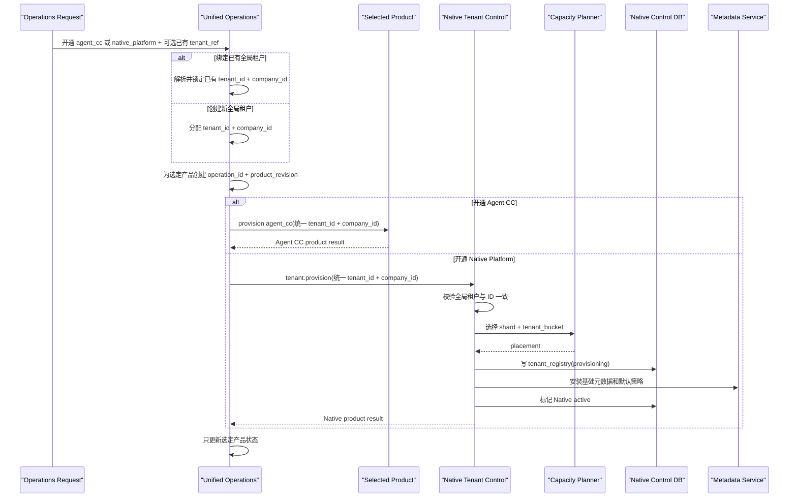

# FEAT-011 - 统一租户运营控制面接入

## 背景与目标

本规格中的“数据平台”及 `Native Platform` 均指 **CloudCC Semattice（语义格）**，即仓库 `/Volumes/AISpace/codehouse/AI-Native-Platform`；`Native Platform` 是历史/协议称谓，产品订阅代码继续使用 `native_platform`。Agent CC / AgentCiCi 和 CloudCC CRM 是外部应用或集成方，不得被称为“数据平台”。品牌更新不改变 Agent CC 与 Semattice 的独立开通、按需绑定和统一租户规则，也不直接变更现有接口字段。

Agent CC 已有一个独立运营管理端，当前只负责 Agent CC 多租户平台的开通和生命周期管理。Agent CC 与 Native Platform 是两个相互独立、都可以单独开通的产品，不存在固定先后或主从关系。

本功能把既有运营管理端扩展为产品无关的统一租户运营控制面。开通任一首个产品前，运营端先创建或解析全局租户并分配 `tenant_id + company_id`；Agent CC 和 Native Platform 分别维护独立产品订阅。某个客户需要同时使用并绑定两个产品时，两项产品订阅必须归属于同一个全局租户并使用完全相同的标识，不能在产品之间再做第二层租户映射。

## 范围

### In Scope

- 复用并扩展既有 Agent CC 运营管理端及其开户接口，不在本仓库重建第二套运营平台。
- 一个全局租户分别对应 `Agent CC 0..1` 和 `Native Platform 0..1` 产品订阅；任一产品都可以单独开通，也可以同时开通。
- 运营控制面统一生成随机 `UUIDv4 tenant_id` 和一对一的 20 位 `company_id`。
- 同一全局租户下的 Agent CC 与 Native Platform 使用同一个 `tenant_id + company_id`；`company_id` 作为稳定、可读的业务编号和兼容标识。
- Native Platform 接收针对全局租户的独立开通、暂停、恢复、套餐/配额变更和注销编排请求，并返回独立的产品侧状态；不要求 Agent CC 已开通。
- Native Platform 在本地 `tenant_registry` 中维护 `tenant_id`、`company_id`、分片、bucket、路由版本、配额投影和产品侧生命周期状态。
- 开户及生命周期原子能力遵循统一 Capability Contract，并提供行为等价的 API、MCP Tool 和非交互式 CLI。
- 为既有 Agent CC 租户设计可审计的全局 `tenant_id` 回填，并支持其保持 Agent CC-only 或以后绑定 Native。

### Out Of Scope

- 两个平台直接共享或互相写入数据库表。
- 把 Agent CC 的账号、密码、凭据、应用角色或业务权限复制到 Native Platform。
- 把 shard、region、bucket、套餐或产品类型编码进 `tenant_id` 或 `company_id`。
- 在本仓库实现既有运营管理端的前端页面。
- 在本决策中改变 `record_id`、`object_id`、`field_id` 等非租户实体的 ID 类型。
- 把两个已经以不同 `tenant_id` 独立运行的产品租户直接改 ID 后合并；该场景需要独立的数据迁移、冲突处理和回滚方案。
- Phase 0 执行不可恢复的租户物理删除或生产级跨平台灾难恢复。

## 用户场景

1. 客户只开通 Agent CC：运营端创建或解析全局租户，然后开通 `agent_cc`；Native 保持 `not_provisioned`。
2. 客户只开通 Native Platform：运营端创建或解析全局租户，然后开通 `native_platform`；Agent CC 保持 `not_provisioned`。
3. 客户以后需要把另一个产品绑定到已有租户：运营端选择已有全局租户，第二个产品必须复用完全相同的 `tenant_id + company_id`，不得重新生成或替换。
4. 任一产品开通暂时失败时，运营控制面只更新该产品状态并用同一 `operation_id` 幂等重试；另一个产品和全局租户不被回滚。
5. 产品级暂停、恢复、套餐变更或注销使用独立产品修订号，只作用于指定产品；全局租户停用则由运营控制面向所有已开通产品传播拒绝状态。
6. Agent CC 已存在的租户在接入前先盘点 `company_id` 并回填 `tenant_id`；这不会自动开通 Native。
7. 支持、审计和计费系统以 `tenant_id` 关联机器数据，以 `company_id` 展示和检索企业租户，并分别查看 Agent CC 与 Native 产品状态。

## 现状与约束

- 既有运营管理端目前以 Agent CC 为中心，需要抽取产品无关的全局租户目录和按产品订阅状态，才能支持 Native-only 与双产品绑定。
- Agent CC 当前数据库以字符串 `org.id` 为组织主键；20 位格式目前必须通过存量盘点和入口约束验证，不能只依赖应用约定。
- Native Platform 尚未实施租户数据库迁移，因此可以从第一版表结构开始使用 PostgreSQL 原生 `uuid tenant_id`。
- 当前部署先做单可用区 PostgreSQL PoC；统一租户控制面不能被误述为已经具备生产 HA 或跨系统强事务。
- Native Platform 是纯 Agent 平台，新增能力必须同时提供 API、MCP 和无交互 CLI；既有运营端是否保留人工 UI 不改变本平台的入口要求。
- 全局租户生命周期与产品开通状态是两个层次：`agent_cc=not_provisioned, native_platform=active` 和反向组合都合法；任一产品未开通都不是全局失败状态。
- Agent CC 身份中心或企业 IdP 可以继续作为共享认证事实源，但共享身份服务必须独立于 Agent CC 产品订阅；Native-only 租户不得因为没有开通 Agent CC 而无法认证。

## 方案设计

### 标识规范

| 标识 | 类型 | 所有者 | 用途 |
|---|---|---|---|
| `tenant_id` | PostgreSQL `uuid`，UUIDv4 | 统一运营控制面 | 两个平台共同的不可枚举机器租户主键、内部关联键、路由键和审计关联键 |
| `company_id` | `varchar(20)` | 统一运营控制面 | Agent CC 兼容、运营展示、API/CLI/MCP 可读业务编号 |
| `operation_id` | 不透明全局唯一 ID | 统一运营控制面 | 跨平台开户和生命周期操作的幂等与审计关联 |
| `tenant_revision` | `bigint`，单调递增 | 统一运营控制面 | 全局租户身份和生命周期版本 |
| `product_revision` | `bigint`，按租户与产品单调递增 | 统一运营控制面 | 拒绝某一产品的乱序开通/生命周期事件覆盖新状态 |

`tenant_id` 与 `company_id` 必须一对一且终身稳定。`tenant_id` 由统一运营控制面使用密码学安全随机源生成 UUIDv4，不复用、不中途修改、不编码创建时间或物理位置；租户迁移只更新 Native Platform 的 `shard_id`、`tenant_bucket` 和 `route_revision`。

UUID 不是授权机制，但比连续整数更适合安全优先的共享数据库租户键：错误、截断、跨环境导入或序列治理失误几乎不可能碰巧命中另一个有效租户，且不需要跨环境协调发号序列。真正的隔离仍由受信 TenantContext、数据库 RLS、同租户复合约束、连接池清理和跨租户拒绝测试共同保证。

新租户的 `company_id` 延续已确认的 20 位约定。若采用 `org` 加 17 位小写字母数字格式，入口和数据库应使用等价于 `^org[a-z0-9]{17}$` 的约束；存量不合规 ID 必须在迁移清单中显式处理，不能静默截断或重新生成。

### 所有权边界

```text
Unified Tenant Operations Control Plane
  owns: tenant_id, company_id, global tenant lifecycle, per-product status
    ├── Agent CC subscription (optional, 0..1)
    │     owns: agent-domain authorization and product state
    └── Native Platform subscription (optional, 0..1)
          owns: shard/bucket route, quotas projection, metadata/data authorization and product state

Shared Identity / Enterprise IdP
  owns: account, login, organization membership and subject status
  availability does not depend on either product subscription
```

- 运营控制面是全局租户目录的唯一写入方。
- 运营控制面为每个租户维护按产品状态；Agent CC 和 Native 的开通是两个对等、独立的 operation，没有固定先后。
- 当前 Agent CC 身份中心可以继续作为账号、登录、组织成员及主体状态的事实源，企业 IdP 可作为上游认证源；但身份能力必须与 Agent CC 产品订阅解耦，供 Native-only 租户使用。
- Native Platform 不再自行把外部组织编号映射成第二个租户 ID，也不能自行创建全局租户 ID；它直接使用运营控制面分配的统一 UUID。
- 两个平台分别保存产品侧授权和审计，使用 `tenant_id`、`company_id`、`subject_id`、`operation_id`、`request_id` 和委托链关联。
- 任何平台都不能通过共享数据库连接或跨库外键绕过接口所有权。

运营控制面的逻辑产品状态至少支持：

```text
tenant_product_status
  tenant_id
  product_code: agent_cc | native_platform
  status: not_provisioned | provisioning | active | suspended | failed | decommissioned
  product_revision
  last_operation_id
```

`agent_cc=active, native_platform=not_provisioned`、`agent_cc=not_provisioned, native_platform=active` 和两个产品都 active 都是合法状态。Native 只有在其产品显式开通后才建立本地 `tenant_registry` 行；任一产品失败不能回滚另一个产品，也不能改变全局租户 ID。

### Native Platform 本地投影

```sql
create table tenant_registry (
  tenant_id             uuid primary key,
  company_id                varchar(20) collate "C" not null unique,
  display_name          varchar(200) not null,
  shard_id              varchar(32) not null references shard_registry(shard_id),
  tenant_bucket         smallint not null check (tenant_bucket between 0 and 127),
  service_tier          varchar(24) not null,
  global_lifecycle_status varchar(24) not null,
  native_status         varchar(24) not null,
  tenant_revision       bigint not null,
  product_revision      bigint not null,
  route_revision        bigint not null,
  metadata_version_id   uuid,
  created_at            timestamptz not null,
  updated_at            timestamptz not null,
  unique (shard_id, tenant_bucket, tenant_id)
);
```

`display_name`、`service_tier`、`global_lifecycle_status` 和修订号是运营事实的本地投影；`native_status`、路由和元数据版本是 Native Platform 在运营编排下维护的产品状态。字段所有权必须在接口 schema 中标明，避免双向更新。

### OneDatabase 租户隔离要求

- 请求 payload 或普通 header 中出现的 `tenant_id` 只能作为待核对值；受信 TenantContext 必须由已验证的运营/身份令牌、`tenant_id + company_id` 一对一目录和 Native active 投影共同解析。
- 所有租户业务表、动态索引、关系、共享、outbox、任务和审计表均使用 PostgreSQL 原生 `uuid tenant_id NOT NULL`，不得使用 `varchar(36)` 或允许空租户行。
- 所有租户表启用并强制 RLS；应用账号不是表 owner 且没有 `BYPASSRLS`。数据库事务使用 `SET LOCAL` 注入 UUID `tenant_id` 和受控 bucket，缺少、非法或不匹配时 fail closed。
- 查找、主从和多对多关系必须用同一 `tenant_id` 约束 source 与 target。优先使用包含 `(tenant_bucket, tenant_id, object_id, record_id)` 的复合外键；无法建立物理外键时必须在同一事务执行等价确定性校验，禁止只凭 `record_id` 定位目标。
- 路由器只能根据受信 `tenant_id` 查询 `tenant_registry`，调用方不能指定 shard/bucket；路由版本变化不能改变 `tenant_id`。
- 连接池必须覆盖成功、rollback、超时和 panic/error 路径的上下文残留测试；跨租户运营查询使用独立身份、独立连接角色和强审计。
- UUIDv4 提供误命中缓冲，不是安全证明；任何“因为 UUID 难猜而省略授权、RLS 或关系校验”的实现都不符合本规格。

### 开户编排



Agent CC 和 Native 开通是对等、独立、可按任意顺序发生的 operation，不使用跨数据库分布式事务。开通第一个产品时可以同时创建全局租户；开通第二个并要求绑定时必须选择已有全局租户并复用其 ID。Native 只需要验证全局租户存在且允许开通，不要求 Agent CC 产品 active。任一产品失败只更新自身状态，不回滚另一个产品，也不生成第二组 ID。

### 最小能力契约

| Capability | 作用 | 必要约束 |
|---|---|---|
| `tenant.provision` | 为已分配租户建立 Native 投影与数据落点 | 仅接受运营控制面身份；幂等；不生成 ID |
| `tenant.get-status` | 查询 Native 产品侧开通和生命周期状态 | 返回全局/产品修订号、路由版本和可重试错误 |
| `tenant.suspend` | 暂停 Native 产品访问 | 不影响另一个产品，不删除数据；高风险审批和审计 |
| `tenant.resume` | 恢复 Native 产品访问 | 必须验证全局状态和产品修订号 |
| `tenant.update-entitlement` | 更新套餐、配额和能力投影 | 版本化、可回放、可审计 |
| `tenant.decommission` | 执行 Native 产品受控注销流程 | 不删除另一个产品或全局租户；异步 operation；不可逆步骤需要独立审批 |

这些能力从同一注册表投影 API、MCP 和无交互 CLI。运营控制面可以只调用功能 API，但其他入口必须保持行为和权限等价，不能形成第二套租户语义。

## 接口与数据影响

开户和生命周期请求至少包含：

```json
{
  "operation_id": "opaque-operation-id",
  "tenant_id": "6522ec2c-6db5-4df7-a96e-3166b03b17a2",
  "company_id": "orgxxxxxxxxxxxxxxxxx",
  "tenant_revision": 1,
  "product_revision": 1,
  "display_name": "Example Enterprise",
  "service_tier": "standard",
  "region": "cn-default"
}
```

- `tenant_id` 在 JSON、MCP 和 CLI 中使用规范 UUID 字符串，在 Go/Java 领域层和 PostgreSQL 中保持 UUID 类型，不允许把任意文本作为未经解析的租户 ID。
- 请求还必须通过认证上下文携带 audience、调用主体、请求 ID 和权限 scope，不把这些安全字段当作可自由填写的业务参数。
- 响应返回 `global_lifecycle_status`、Native `native_status`、`tenant_revision`、`product_revision`、`route_revision` 和结构化错误，不返回数据库端点或凭据。
- 运营控制面和两个产品分别保留审计；日志不得记录 token、密码、连接串或完整敏感配置。

## 迁移与兼容

1. 导出并核验 Agent CC 现有组织清单，确认 `company_id` 唯一性、格式、状态和重复/异常数据。
2. 在统一运营控制面为每个现有 `company_id` 分配唯一 UUIDv4 `tenant_id`，建立不可变一对一目录。
3. Agent CC 增加 `tenant_id` 唯一映射并登记 `agent_cc=active`；不在首步替换现有字符串主键和所有外键，`native_platform` 默认为 `not_provisioned`。
4. 新开任一产品时，运营接口先解析已有全局租户或创建新目录，再只开通所选产品；Native-only 和 Agent CC-only 都是合法结果。
5. 后续绑定第二个产品时必须选择已有全局租户并复用 ID；若发现同一客户已在两个不同 `tenant_id` 下运行，必须停止自动绑定并进入独立合并/迁移流程。
6. 只对明确选择的产品，以幂等 `operation_id` 执行开通；记录成功、失败、重试和人工处置结果。
7. 验证完成前保留兼容读取路径；任何回滚只暂停或撤销当前产品开通，不删除已经建立的全局标识或另一个产品。

## 交付计划

- 对应任务：`TASK-011`
- 依赖：`TASK-010` 工程与技术基线；运营管理端接口清单、共享身份依赖盘点和 Agent CC 存量租户盘点。
- 责任角色：`integration-agent` 主责，`backend-agent`、Agent CC 维护者和运营平台维护者共同评审。
- 主要修改范围：Native `tenant_registry`、TenantContext、内部认证、Capability Contract、开户编排适配器、事件/审计和隔离测试。
- 实施前先锁定既有开户接口的版本化扩展方式，不能在 Native 侧猜测或复制现有协议。

## 验收标准

- [ ] Agent CC-only、Native-only 和两个产品都 active 三种组合均可独立开户、查询、暂停和恢复。
- [ ] 开通任一首个产品时只生成一组稳定的 `tenant_id + company_id`；未开通产品保持 `not_provisioned`。
- [ ] 后续绑定第二个产品时必须选择已有全局租户并复用完全相同的 `tenant_id + company_id`；每个全局租户对每种产品最多一个投影。
- [ ] Native Platform 所有租户列使用 PostgreSQL 原生 `uuid`，不存在字符串化 UUID 列或第二套组织到租户映射。
- [ ] Agent CC 与 Native Platform 都不能自行生成全局租户 ID，也不能直接写运营平台或对方数据库。
- [ ] 任一产品开通失败只影响该产品状态，可通过同一 operation 幂等恢复；另一个产品和全局租户不被回滚。
- [ ] Native-only 租户可通过共享身份服务或企业 IdP 正常认证，不依赖 Agent CC 产品订阅 active。
- [ ] 暂停、恢复、套餐变更和注销能拒绝乱序修订，并留下跨平台可关联审计。
- [ ] 既有 Agent CC 租户盘点和 `tenant_id` 回填具有可重复、可暂停、可核对的报告；未选择 Native 的租户保持 `not_provisioned`。
- [ ] 两个已使用不同全局 ID 的产品租户不能被静默绑定；系统返回明确冲突并要求独立合并/迁移流程。
- [ ] 缺少运营身份、错误 audience、伪造 `tenant_id/company_id`、重复操作、乱序修订和跨租户访问均被拒绝。
- [ ] 使用另一个有效租户 UUID 的查找、主从、多对多、共享、任务和连接池残留攻击全部 fail closed，并产生安全审计。
- [ ] `tenant.provision` 等已发布原子能力通过 API/MCP/CLI 行为等价测试。
- [ ] PostgreSQL 查询计划和容量测试验证 UUID `tenant_id` 的索引、RLS、分区裁剪与路由路径，并量化相对 `BIGINT` 的存储和缓存成本。

## 风险与回滚

- 产品开通失败：由运营控制面保存该产品步骤状态并幂等重试；另一个产品保持可用，禁止回滚为另一个租户 ID。
- 已有产品租户绑定冲突：若双方已属于不同 `tenant_id`，禁止直接更新映射；进入独立迁移评审，避免数据错绑或串租。
- 存量 `company_id` 不满足 20 位约束：进入异常清单并制定显式兼容方案，不截断、不覆盖。
- UUID 被误当作普通字符串：接口边界强制 UUID schema 和规范解析，领域层使用 UUID 类型，数据库禁止 `varchar(36)` 替代原生 `uuid`。
- 生命周期状态漂移：使用 `tenant_revision + product_revision`、周期对账和差异告警修复。
- 运营控制面不可用：已有 active 租户继续按本地投影运行；禁止新开户和不可逆生命周期变更。
- 回滚只关闭当前产品编排入口并暂停批次；已经分配的 `tenant_id` 和 `company_id` 永不回收复用，另一个产品不受影响。

## 实现进展

- 当前状态：当前仓库 L2 实现与 maker 验证完成，等待最终独立 checker。
- 已完成：统一标识与边界、Agent CC 只读差异盘点、`native-tenant-operations.v2` port/claim-bound adapter、JWT issuer/audience/algorithm/expiry/scope/tenant/company/subject 验证、Native PostgreSQL 投影、持久 operation/audit、修订状态机和六项三入口能力。
- 外部接入项：运营控制面的产品无关 v2 接口改造和 Agent CC 存量 UUID 回填属于其他仓库；本仓库没有越权写入。它们是部署前集成任务，不影响 Native v1 port 和投影代码的完成状态。
- 授权边界：允许本机专用 Docker PostgreSQL PoC 与当前仓库 adapter/identity/TenantContext 源码和测试；不允许生产或共享远程系统访问、真实租户数据、其他仓库写入、部署或远端发布。

### Agent CC 身份契约状态

2026-07-24 已在 Agent CC 实施 V94 顶层身份统一：

- 当前开户入口为 `POST /platform/tenants`，服务通过 `PlatformTenantLifecycleService.createTenant` 调用 `AuthService.createCompany`；返回 `companyId/companyName/status/ownerMemberId/ownerAccountId/reusedExistingAccount`。
- 顶层身份字段、JWT claim 和开发态 Header 已统一为 `company_id` / `companyId` / `X-Company-Id`。旧 `org_id` / `orgId` 输入不兼容且 fail closed；现有编号值继续采用 `^org[a-z0-9]{17}$` 的 20 位格式，不重键。
- 当前成员 JWT 以 HMAC 签名，含 `sub/company_id/member_id/account_id/roles/iat/exp`；平台 token 使用 `typ=platform/platform_account_id/roles` 且没有租户。当前实现未提供 Native 所需的独立 issuer/audience/global `tenant_id` 约束。
- 当前 TenantContext 从 Bearer JWT 提取 `company_id/member_id/roles`，部分部署可允许 header context。Native 不得继承“普通 header 即受信上下文”的模式。

因此当前仓库实现 `operations.Port` 的版本化 v2 Native 契约和 local/test adapter，不假装已完成跨仓库集成。未来运营端 v2 必须提供并签署：`tenant_id`、`company_id`、`product_code=native_platform`、单调 `tenant_revision/product_revision`、全局唯一 `operation_id`；共享身份 token 必须验证允许算法、issuer、audience、expiry、scope，并同时携带可核对的 `tenant_id + company_id + subject_id`。任何缺失或不匹配均 fail closed。

## 交接说明

下一位接手者先读取 ADR-009、本规格、现有运营开户接口、共享身份依赖和 Agent CC 组织表迁移。首先输出产品无关全局租户目录、独立产品订阅、绑定契约与存量数据差异报告，再实现 Native 适配器；不要假定 Agent CC 必须先开通，不要新建第二个租户目录，不要让产品侧生成租户 ID，也不要把记录 ID 类型变更混入本任务。

## 当前仓库完成证据

- `tenant.provision`、`tenant.get-status`、`tenant.suspend`、`tenant.resume`、`tenant.update-entitlement`、`tenant.decommission` 均由同一 Registry/Invoker 投影；authenticated API、agent CLI 和 authenticated MCP 返回等价状态。
- Provision 不生成全局 ID，只接受 verified `tenant_id + company_id`；失败的身份冲突不占用 operation，修正后同 operation 可恢复；成功重放返回同一持久结果，不同 input 返回 `IDEMPOTENCY_CONFLICT`。
- product revision 乱序被拒绝；暂停/恢复/entitlement 独立变更。decommission 不物理删除，只持久化 `pending_approval`，且不提前推进产品状态/修订。
- JWT 负向覆盖 wrong issuer、audience、key/algorithm、expiry、tenant、company、subject 和 scopes；API 不信任请求体 tenant/actor，MCP/CLI 由启动时 agent token 绑定 principal。
- 真实 PostgreSQL 16 测试验证 lifecycle、operation、audit 和 RLS 前提；全量 race、vet 和 module verification 通过。
- 独立 checker 首轮阻断了超级用户单 pool 接线。修复后 tenant service 只使用 `ai_native_control`：该角色非 owner/非 superuser/非 BYPASSRLS，仅通过三张控制表上的显式 role policy 和 grants 工作；集成测试及真实 main wiring 不再把 postgres 管理连接传给 service。
- 第三轮独立 checker 在移除 control 对 `shard_registry` 的多余读取权后确认精确三表权限、开户、生命周期、真实 main 双角色接线和三入口 parity 全部 `PASS`。
