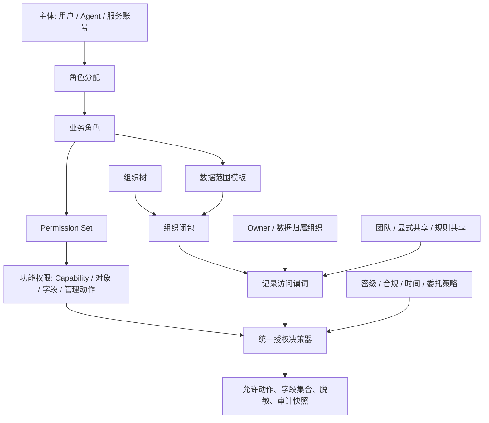

# FEAT-016 - 角色中心 RBAC、组织数据范围与混合记录共享

## 背景与目标

平台当前已实现验证 JWT 后的 Capability Scope 门禁、可信 TenantContext、运行时连接隔离和 PostgreSQL FORCE RLS。它们分别解决“是否可调用已发布能力”和“是否跨租户”的问题；它们不解决同一租户内用户能否操作某对象、字段或记录。

本功能建立租户内业务授权模型，目标是：

- 以业务角色为管理员配置和审计的中心，支持最小权限、职责分离和权限互斥。
- 用可复用 Permission Set 组合对象、字段、Capability 与平台管理原子权限，避免角色组合爆炸。
- 不采用 Salesforce 风格的业务 `Profile`；身份/会话安全策略与业务角色分离。
- 组织树只计算数据范围与层级记录共享，**不**让父组织的功能权限自动下放到子组织。
- 以 Owner、记录数据归属组织、团队、显式共享和规则共享共同决定记录访问；默认避免物化“记录 × 用户”ACL。
- 对 API、MCP、CLI 和后续异步任务施加同一授权决策、字段裁剪和审计语义。

## 范围

### In Scope

- 用户、Agent、服务账号的本地最小主体投影、组织成员关系、角色、权限包、原子权限和职责分离规则。
- 对象 CRUD/特殊动作、字段 read/write/mask、平台管理权限和 Capability Scope 的联合决策。
- 每对象默认记录访问基线、Owner、组织数据范围、记录团队、手工/审批共享和条件共享规则。
- 组织树闭包、用户调岗、组织合并/退休、记录归属转移与权限快照失效语义。
- 记录查询谓词、详情/写入校验、返回前字段裁剪与脱敏，以及 API/MCP/CLI parity。
- PostgreSQL 数据模型、索引、异步投影边界、审计与验收计划。

### Out Of Scope

- 复刻 Salesforce `Profile`、页面布局、Tab、UI 应用分配或任何 Web 管理界面。
- 复制、读取或写入 Agent CC/企业 IdP 的用户表、角色表、密码或长期凭据。
- 将 RLS 扩展为租户内完整业务记录权限；RLS 继续只承担租户隔离。
- 将所有有效记录权限物化为 `record × user` ACL，或为组织层级逐记录生成 share 行。
- 全文搜索、OLAP、外部连接器和通用 worker/outbox 实现；它们在访问控制接口稳定后独立接入。

## 用户场景

1. 租户安全管理员创建“销售专员”“销售经理”“权限管理员”“安全审计员”角色，并给角色关联最小权限包。
2. 销售专员能编辑本人负责的商机；销售经理能在拥有对象 Edit 权限的前提下编辑本组织及下级组织记录。
3. 华东销售人员的单条商机临时共享给北京法务组只读，不给该组每位成员各写一条 ACL。
4. 张三从上海销售部调到北京销售部时，张三的组织成员关系改变，但历史记录的负责人和数据归属组织不隐式改变；张三仍因 Owner 身份访问这些记录，除非显式执行记录交接。
5. 上海和杭州销售部合并为华东销售部时，系统以可审计、可恢复的组织重组操作迁移成员、记录归属和规则；旧组织不物理删除。
6. 元数据设计师不能审批或发布自己发起的高风险 Changeset；权限管理员不能兼任安全审计员。

## 现状与约束

- `runtime.record.*` 当前只根据 JWT 中的精确 Capability Scope 放行，并用 TenantContext/RLS 限制租户；业务对象、字段、记录共享与权限快照尚未实现。
- `object_record` 已有 `owner_id`，但它当前没有业务授权语义，也没有稳定的数据归属组织字段。
- 所有新增业务授权表都必须携带 `tenant_bucket, tenant_id`，使用同租户复合外键、FORCE RLS 和 `ai_native_runtime` TenantContext。
- 控制角色和运行时角色是 PostgreSQL 技术账号，绝不是“超级管理员”“安全审计员”等业务角色。
- 共享身份/企业 IdP 仍是认证、主体状态和组织成员事件的事实源；Native 保存最小授权投影并在本地计算授权。

## 设计原则

1. **角色中心，权限包复用。** 管理员以角色授予职责；角色关联 Permission Set；Permission Set 承载原子权限。
2. **功能权限与数据权限分离。** “可编辑商机”是对象权限；“可编辑哪些商机”是记录数据范围。
3. **默认拒绝。** 对象、字段、记录、策略任一层拒绝即拒绝；共享不能扩大字段或对象权限。
4. **组织树仅服务数据范围。** 不从父组织向子组织自动传播功能权限。上级访问下级数据由数据范围谓词表达。
5. **不隐式改写历史。** 用户调岗不更新历史记录；组织合并必须走显式重组/迁移操作。
6. **共享按组优先、例外最小化。** 层级访问运行时计算；规则最多投影到 `record × group`，禁止投影到 `record × user`。
7. **同源三入口。** API、MCP、CLI 和异步执行器均调用同一个授权决策器（PDP）与记录谓词生成器。

## 授权模型概览



### 授权决策顺序

```text
1. 验证身份、tenant/org、主体状态、委托链和会话策略。
2. 校验当前 Capability 的 RequiredScope（现有平台硬门槛）。
3. 解析主体的有效角色、Permission Set、互斥约束和 permission_snapshot。
4. 校验对象动作权限；无对象动作权限立即拒绝。
5. 校验请求字段的写权限，或计算返回字段的读权限/脱敏策略。
6. 为 get/query/update/delete 生成记录访问谓词。
7. 叠加密级、区域、记录状态、时间、设备风险和委托范围等限制策略。
8. 执行业务操作；返回前再次裁剪字段并记录授权依据。
```

对象、字段、记录三层都是必要条件。`View all` / `Modify all` 类型的跨范围能力是高风险平台权限，默认不授予普通角色，必须经过独立审批、短期有效期和强审计。

## 数据模型

以下表均省略公共的 `tenant_bucket, tenant_id, created_at, updated_at`；实际 schema 必须包含它们、同租户复合键与 RLS policy。

### 主体、组织与用户组

| 表 | 关键字段 | 说明 |
|---|---|---|
| `principal_projection` | `principal_id`, `principal_type`, `status`, `identity_version` | 本地最小主体投影；`principal_id` 对应已验证 token 的 `sub`，类型为 `human/agent/service`。不是账号或密码事实源。 |
| `organization_node` | `organization_id`, `parent_organization_id`, `name`, `organization_type`, `status`, `merged_into_organization_id` | 组织树节点；状态为 `active/merging/merged/retired`。 |
| `organization_closure` | `ancestor_organization_id`, `descendant_organization_id`, `depth` | 祖先—后代闭包；`depth=0` 表示自身。仅用于组织数据范围。 |
| `principal_org_membership` | `principal_id`, `organization_id`, `is_primary`, `status`, `valid_from`, `valid_to` | 当前或历史的用户组织归属；用户可多组织，但至多一个当前主组织。 |
| `access_group` | `group_id`, `group_type`, `name`, `status` | 静态/系统用户组，是共享规则的优先受让者。 |
| `group_membership` | `group_id`, `principal_id`, `valid_from`, `valid_to` | 组成员关系；初期不支持无界嵌套组。 |

### 角色、权限包与职责分离

| 表 | 关键字段 | 说明 |
|---|---|---|
| `authorization_role` | `role_id`, `api_name`, `label`, `role_kind`, `status` | 业务职责角色；`built_in/custom`，不直接承载逐项权限。 |
| `permission_set` | `permission_set_id`, `api_name`, `label`, `status` | 可复用原子权限包。 |
| `permission` | `permission_id`, `resource_type`, `resource_ref`, `action`, `risk_level` | 原子允许权限，资源可为 `capability/object/field/platform/iam/organization/audit`。 |
| `permission_set_permission` | `permission_set_id`, `permission_id` | 权限包与原子权限多对多。 |
| `role_permission_set` | `role_id`, `permission_set_id` | 角色组合权限包。 |
| `principal_role_assignment` | `assignment_id`, `principal_id`, `role_id`, `valid_from`, `valid_to`, `granted_by`, `approval_id` | 主体拥有的角色；常规授权从此表进入，不提供任意直授原子权限。 |
| `role_data_scope` | `role_id`, `object_id`, `action`, `scope_type`, `condition` | 每角色、对象和动作的数据范围。 |
| `role_conflict` | `role_id`, `conflicting_role_id`, `reason`, `policy_code` | 对称互斥关系；角色分配和审批时同步校验。 |

`permission` 例子：

```text
runtime.record.read
metadata.object.create
metadata.field.update
metadata.version.publish
iam.user.create
iam.role.assign
organization.reorganize
audit.read
```

管理权限与业务对象权限都进入同一原子权限体系，但作用域和职责分离不同。身份安全属性（MFA、登录时间/IP、会话长度、服务账号凭据和 Agent 预算）属于 `principal_access_policy`，不属于角色。

### 记录授权锚点与共享

`object_record` 必须扩展为以下明确语义；不得使用含义模糊的 `owner_organization_id`：

| 字段 | 语义 |
|---|---|
| `owner_principal_id` | 当前记录负责人；Owner 权限以该稳定主体 ID 计算。 |
| `data_organization_id` | 记录的业务数据归属组织，是层级数据范围的锚点；初次创建时可以由当前主组织默认填充，但此后独立于 Owner 当前组织。 |
| `classification` | `public/internal/confidential/restricted` 等数据密级。 |
| `lifecycle_state` | 记录状态，参与限制策略。 |

共享表：

| 表 | 关键字段 | 说明 |
|---|---|---|
| `record_team_member` | `object_id`, `record_id`, `member_type`, `member_id`, `team_role`, `access_level`, `valid_to` | 某条记录的长期协作团队；成员可为主体或用户组。 |
| `share_grant` | `grant_id`, `object_id`, `record_id`, `grantee_type`, `grantee_id`, `access_level`, `grant_source`, `reason`, `granted_by`, `valid_to`, `revoked_at` | 手工、审批、工作流或集成产生的例外共享。受让者优先为用户组。 |
| `sharing_rule_def` | `rule_id`, `object_id`, `source_selector`, `target_group_id`, `access_level`, `status`, `revision` | 条件/所有者共享规则定义，不是逐用户结果表。 |
| `share_projection` | `rule_id`, `object_id`, `record_id`, `target_group_id`, `access_level`, `source_version` | 可选的高热规则投影；只允许 `record × group`，不允许 `record × user`。 |
| `permission_snapshot` | `principal_id`, `policy_version`, `membership_version`, `role_version`, `organization_version`, `computed_at`, `expires_at` | 缓存有效角色、功能权限、字段策略与数据范围版本；绝不保存该主体的完整 record ID ACL。 |

### 数据范围

`role_data_scope.scope_type` 仅允许：

| 类型 | 含义 |
|---|---|
| `own` | `owner_principal_id = 当前主体`。 |
| `organization` | `data_organization_id` 为主体当前/被分配组织。 |
| `organization_descendants` | `data_organization_id` 位于被分配组织的闭包子树中。 |
| `assigned_organizations` | 指定组织集合及其子树。 |
| `all_tenant` | 租户内全部记录；高风险且不作为普通角色默认值。 |
| `conditional` | 受限 JSONB 等值条件：`{"equals":{"region":"east","stage":"open"}}`，最多五个数据字段，值仅限字符串/数值/布尔；不接受任意 SQL、嵌套 JSON 或脚本表达式。 |

每对象默认记录访问基线为 `private`：只有 Owner、有效数据范围、团队和共享路径命中的主体可访问。公开读写必须作为对象级、版本化的显式策略，不能由 UI 可见性推断。

## 记录访问与共享计算

对于拥有对象动作权限的主体 `P`，记录 `R` 的基础允许集合为：

```text
Owner(P, R)
OR DataScope(P, R.data_organization_id)
OR Team(P, R)
OR DirectShare(P, R)
OR RuleShare(P, R)
OR ExplicitObjectDefault(P, R)
```

随后与以下限制相交：字段权限、`classification`、租户/主体状态、委托资源范围、时间/区域/设备策略及强制拒绝策略。共享只增加记录候选集合，绝不绕过对象、字段、Capability 或限制策略。

### 查询实现边界

- `organization_descendants` 通过 `organization_closure` 与 `object_record.data_organization_id` join/exists 计算；不生成“下级记录共享给上级经理”的 share 行。
- `share_grant` 查询受让主体和其用户组；每条记录的直接授权数量受配额和有效期限制。
- `sharing_rule_def` 优先编译为受控 SQL 谓词；只有明确的热点规则才异步生成 `share_projection(record, group)`。
- 投影未完成时必须实时计算或 fail closed，不得把未验证的候选记录暴露给受让者。
- `get`、`query`、`update`、`delete`、导出和搜索回读都必须使用同一记录谓词。搜索/OLAP 只能使用权限过滤提示，最终结果必须由运行时重新校验。

## 组织、Owner 与记录生命周期

### 用户调岗

用户调岗只更新 `principal_org_membership` 并失效相关 permission snapshot；默认不更新任何 `object_record`。

```text
调岗前：owner_principal_id=张三，data_organization_id=上海销售部
张三调入北京销售部
调岗后：owner_principal_id=张三，data_organization_id=上海销售部
```

因此张三仍因 Owner 路径访问原记录；上海管理者仍因数据归属组织访问；北京管理者不会仅因张三调入而自动获得原上海记录。若业务要求客户/案件交接，必须执行独立的、可审计的记录转移操作，显式修改 Owner、数据归属组织或创建带有效期的共享。

### 组织合并、退休与删除

组织不物理删除且禁止 `ON DELETE CASCADE`。部门合并使用 `organization_merge_operation` 与 `record_organization_history`：

1. 将源组织置为 `merging`，停止新增成员与记录归属；创建/指定目标组织。
2. 冻结重组计划：下级组织、成员、记录、角色分配、共享规则和快照影响。
3. 显式、分批迁移成员和记录 `data_organization_id`，并记录覆盖率与失败。
4. 迁移/替换引用源组织的角色作用域和共享规则；直接 `share_grant` 保持记录级语义。
5. 重建组织闭包、失效快照和缓存；完成覆盖验证后将源组织标为 `merged` 并记录 `merged_into_organization_id`。

组织重组不自动合并角色权限。例如两个部门的管理员权限不能因部门合并而取并集；角色迁移必须以显式映射、审批和职责分离检查完成。

## 职责分离与内置角色

| 内置角色 | 允许职责 | 不允许职责 |
|---|---|---|
| `tenant_super_admin` | 受控紧急治理、恢复和高风险授权 | 默认长期全数据访问；必须短期、MFA、审批与完整审计。 |
| `application_admin` | 应用与低风险配置管理 | 用户、角色、审计或组织重组管理。 |
| `metadata_designer` | 对象、字段、关系和草稿 Changeset 编辑 | 审批/发布自己发起的高风险 Changeset。 |
| `access_admin` | 用户组、角色分配、权限申请处理 | 安全审计、授予高于自身的角色。 |
| `organization_admin` | 指定组织子树维护与重组计划 | 跨范围组织重组、权限包定义或审计修改。 |
| `security_auditor` | 审计、授权历史和敏感访问只读 | 任意业务/授权修改。 |
| `business_manager` | 所辖组织业务记录与团队管理 | 平台/IAM 管理权限。 |

至少强制：`access_admin ⟂ security_auditor`、同一 Changeset 的设计者 `⟂` 审批/发布者、组织重组发起者 `⟂` 同一重组审批者。互斥在角色分配、委托、审批和紧急授权时均检查。

## API、Capability 与审计

新增 Capability 按风险拆分为对象、字段、角色、组织与共享域，示例：

```text
authorization.role.create / update / assign / revoke
authorization.permission-set.create / update
organization.create / update / reorganize / merge
record.share.grant / revoke
record.team.manage
authorization.access.explain
```

- 高风险的角色定义修改、超级权限授予、组织合并、共享规则发布和跨范围导出必须异步、双人审批、幂等并有审计。
- `authorization.access.explain` 仅向审计/授权管理员显示最小必要的授权依据，不泄露未授权记录或敏感规则内容。
- 审计事件至少记录：主体/委托人、tenant、角色与权限包版本、数据范围来源、共享原因、组织/成员版本、对象/记录标识、字段掩码、决策、拒绝原因和 trace/request ID。

## 交付计划

1. **授权基础模型**：migration、最小主体投影、角色、权限包、原子权限、角色分配、互斥规则和 permission snapshot。
2. **对象与字段 PDP**：在 Capability Handler 前检查对象动作；写入前过滤字段；返回前裁剪/脱敏字段；建立三入口 parity 测试。
3. **组织数据范围与 Owner**：扩展 `object_record.data_organization_id`，实现闭包、数据谓词、调岗与记录交接审计。
4. **共享**：实现团队、`share_grant`、规则定义和可选 `record × group` 投影；与通用 worker/outbox（TASK-017）对接。
5. **组织重组与性能**：实现 merge operation、快照失效、失败恢复、容量/热点公平性测试（TASK-019）。

迁移必须先建表和只读决策，再按对象逐步启用 enforcement；未启用对象不得误报受业务 RBAC 保护。任何过渡期均继续由 TenantContext/RLS 保证跨租户 fail closed。

## 验收标准

- [x] 无角色/权限包/对象动作许可的主体无法通过 API、MCP 或 CLI 操作对象。
- [x] 字段 read/write/mask 在详情、列表、写入、导出与三入口中一致执行；共享不能绕过字段权限。
- [x] `private` 对象中，Owner、组织范围、团队、显式共享和规则共享各自的 allow/deny 路径可解释并有测试。
- [x] 上级组织访问下级数据由闭包谓词实现；不生成层级 `record × user` share 行；下级不反向获得上级数据。
- [x] 用户调岗不修改历史记录；Owner 保留访问直到显式交接/撤销；目标组织不自动取得原组织记录。
- [x] 组织合并无物理删除或级联删除，成员/记录/规则迁移可恢复，审计历史保持原组织 ID。
- [x] 角色互斥、自审禁止、越权角色分配、跨组织管理、过期临时授权和 Agent 委托越界全部 fail closed；独立审批由受信身份提供，未暴露委托写入入口。
- [x] 共享查询不会物化 `record × user` ACL；本机 100 万记录、10 万条热点规则组投影与 50 并发的谓词成本有真实证据；更大容量矩阵保留在 TASK-019。
- [x] RLS、对象、字段、记录和审计负向测试共同通过；不能将任一单层测试误报为完整授权验证。

## 风险与回滚

| 风险 | 控制措施 |
|---|---|
| 角色/权限包组合爆炸 | 权限包复用、角色只承载职责和数据范围、禁止常规直授原子权限。 |
| 组织调岗导致历史数据突然扩权 | Owner 与 `data_organization_id` 分离；调岗不隐式迁移记录。 |
| 共享规则产生海量行 | 规则定义/谓词优先，投影只到 group，例外共享配额和过期。 |
| 缓存或搜索泄露旧权限 | permission snapshot 版本化、成员/组织/规则变更事件失效、结果回读复核。 |
| 管理权限过度集中 | 最小权限包、互斥约束、作用域上限、审批、短期 break-glass 与审计。 |
| 组织合并部分完成 | `merging` 状态、进度 checkpoint、覆盖率门禁、源组织 tombstone 和可重试批次。 |

回滚不通过删除授权历史实现。应撤销新角色/共享/规则版本，恢复上一个有效 policy snapshot；组织重组在完成切换前可取消，完成后通过新的受审计重组操作修正。

## 实现进展

- 当前状态：`approved`，用户已确认本规格中的角色中心模型、无业务 Profile、组织数据范围、Owner 调岗、组织合并和混合共享边界。
- 已完成：migrations 7–12、主体/组织/角色/Permission Set/权限/数据范围/共享/快照表、对象/字段/记录 PDP、Owner 与稳定 `data_organization_id`、直接共享、组/团队、受约束的共享规则定义和有界 `record × group` 投影刷新、角色冲突、对象策略受控发布、`authorization.access.explain` 最小依据与持久审计、组织合并/取消/记录归属历史，以及角色撤销、到期角色分配和受审批的数据范围配置。规则仅在投影 `ready` 时参与授权，构建中 fail closed；新建记录与数据归属变更由触发器维护 ready rule 的 group 投影；末批刷新会检查任一匹配记录是否缺边，若构建期变更造成缺边则清空游标进行下一轮有界 catch-up，而不会过早 ready。无组织锚点 scope 具有 NULL-safe 幂等约束；disabled access group 不再产生 direct/group/rule share 或 explain 依据。合并源组织变为 `migrating` 后不再可作为受保护记录的主归属组织；真实两批记录迁移在完成时验证目标归属和成员转移。管理动作同时要求 Capability Scope、platform 原子权限；高风险动作要求 verified approval；权限包写入/绑定与角色分配验证发起人不能转授其未持有的原子权限。
- 条件数据范围：`authorization.role.set-data-scope` 已实现并仅接受 `condition.equals`；表达式在写入时规范化，在记录谓词中通过参数化 `jsonb @>` 执行，`access.explain` 同时给出 `conditional_scope` 依据。API、MCP、CLI 的正向与非法嵌套表达式拒绝均有真实 PostgreSQL 覆盖。
- 本地容量证据：专用 PostgreSQL 16 本机容器上，`TestAuthorizationLocalSimulation` 写入 1,000,000 条记录；按组织共享规则生成 100,000 条 `record × group` 投影而非用户 ACL；在当前谓词实现上 50 并发运行时读取 p50 为 285.095 ms、p95 为 353.419 ms。它证明当前组织闭包与投影谓词在该本机负载下可工作，不是生产 SLA，也不替代 TASK-019 的 200 活跃用户、热点公平性与 8/16 GiB 验收。
- 依赖边界：共享投影已具备 `building/ready/failed`、显式失败重试、缺边 catch-up 和 fail-closed 行为；通用 worker/outbox 调度和告警仍由明确分离的 TASK-017 交付。角色分配支持 `expires_at`；对象/字段/平台权限、数据范围、冲突和转授权检查均以数据库时钟忽略到期分配。授权管理 Capability 统一写入持久 `audit_event`（审批令牌不入库）；`access.explain` 保留事务内的详细决策审计。

## 交接说明

实现前先阅读 FEAT-012（RLS）、FEAT-013/014（元数据与 Changeset）、FEAT-015（记录运行时）及 ADR-006/009/011。不得将数据库 technical role 当作业务角色；不得复活 Profile 作为数据范围载体；不得将组织层级实现为父组织功能权限向下继承；不得以 `record × user` share 表掩盖查询谓词设计。
