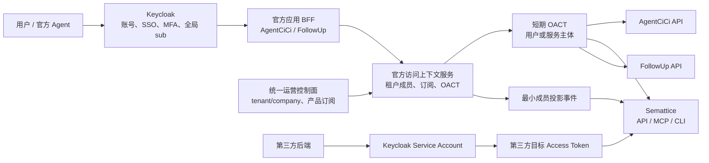
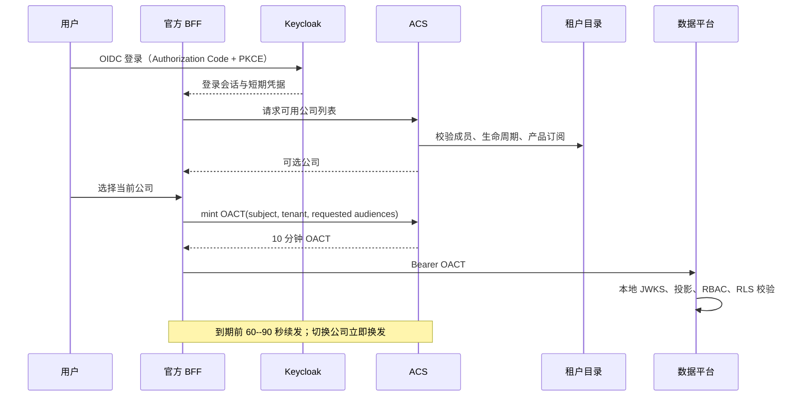

# FEAT-028 - Keycloak 统一身份与官方应用认证互通

## 背景与目标

CloudCC Semattice（语义格，以下称“数据平台”）将与 AgentCiCi、未来的 FollowUp 等官方自有应用组成产品组合，同时仍要作为可被第三方后端安全调用的数据平台。现有数据平台 HTTP API、Streamable HTTP MCP、stdio MCP 和无交互 CLI 已共享一个 JWT principal 绑定模型，但当前验证器仅支持共享 HS256 密钥；它不能直接成为 Keycloak OIDC Resource Server，也没有官方应用的租户上下文签发与成员投影同步机制。

本规格确定以下目标：

1. Keycloak 是唯一的身份提供方（IdP），负责账号、密码、SSO、MFA、全局主体 `sub` 和服务账号认证；任何产品不得复制密码或长期用户凭据。
2. AgentCiCi、数据平台、FollowUp 等官方应用以一个短期、租户绑定的官方上下文 Access Token 高效互通；不在每次 API、MCP Tool 或应用间调用时向 Keycloak 换 Token。
3. 第三方后端使用独立 Keycloak Confidential Client / Service Account，只获得其被明确授权的数据平台 audience、scope 和租户范围，永远不获得官方应用组合的广域 Token。
4. 数据平台继续独立执行 Capability Scope、RBAC、组织数据范围、记录共享和 RLS；Token 只构造可信身份与租户上下文，不扩大数据权限。
5. 新官方应用只需注册 audience、scope 与产品订阅规则即可接入，不形成 AgentCiCi ↔ 数据平台 ↔ FollowUp 的两两 Token Exchange 网状耦合。

本规格中的“数据平台”始终且仅指本仓库的 CloudCC Semattice：`/Volumes/AISpace/codehouse/AI-Native-Platform`。AgentCiCi、FollowUp 和第三方产品均是调用方或集成方。

## 范围

### In Scope

- Keycloak、统一运营控制面、官方访问上下文服务和官方应用 Resource Server 的职责边界。
- 用户、官方服务和第三方服务三种主体的 Token 获取、续期、吊销与审计流程。
- API、远程 MCP、stdio MCP 和 CLI 的统一认证协议。
- Keycloak 全局用户、AgentCiCi 全局账户/公司成员、数据平台最小主体投影和租户内组织成员的映射边界。
- 数据平台从 HS256 迁移到 JWKS 验签、多 Issuer 信任策略、成员投影与本地撤销门禁的设计。
- 官方应用/产品注册、scope、audience、委托链、事件和最小数据契约。
- 分阶段实施、验收、回滚和未实现边界。

### Out Of Scope

- 在本任务中部署 Keycloak、创建生产 Realm、Client、密钥、证书或真实用户。
- 修改 AgentCiCi、FollowUp 或第三方系统代码、数据库和远程配置。
- 复制 Keycloak、AgentCiCi 或任一应用的用户表、密码、MFA 因子、Refresh Token 或数据库权限。
- 以 Keycloak realm/client role 直接替代数据平台的业务角色、字段权限、记录权限或共享规则。
- 将所有官方调用限制在内网、IP allowlist 或 HMAC；所有调用均按公开 HTTPS 上的零信任 Bearer Token 模型设计。mTLS 可作额外的客户端认证和链路保护，但不是唯一信任边界。

## 术语与身份层级

| 名称 | 含义 | 事实源 |
|---|---|---|
| Keycloak `sub` | 全局、不可变的认证主体标识；用户或服务账号的外部身份 | Keycloak |
| `account_id` | AgentCiCi 全局账户键 | AgentCiCi `user_account` |
| `member_id` | AgentCiCi 在一个 `company_id` 下的成员记录键 | AgentCiCi `organization_member` |
| `tenant_id + company_id` | 跨产品统一租户身份；公司是全局租户，不是数据平台部门 | 统一运营控制面 |
| `principal_id` | 数据平台租户内最小主体键；本方案中等于可信 Keycloak `sub` | 数据平台 `principal_projection` |
| `organization_id` | 数据平台租户内的部门/数据范围组织节点 | 数据平台 `organization_node` |
| OACT | Official Access Context Token，官方上下文 Access Token | 官方访问上下文服务签发 |

一个 Keycloak 用户与一个 AgentCiCi 全局账户是 `1:1` 绑定；一个全局账户可属于多个公司；一个数据平台主体可属于多个数据平台租户。AgentCiCi 的公司成员关系不等于数据平台内部部门关系，禁止把 `organization_member.id` 直接写成数据平台 `organization_id`。

## 总体架构



### 组件职责

| 组件 | 职责 | 明确不负责 |
|---|---|---|
| Keycloak | 登录、账号、SSO、MFA、服务账号、全局 `sub`、Client 认证 | 产品租户授权、数据平台 RBAC、记录权限 |
| 统一运营控制面 | `tenant_id/company_id`、全局生命周期、官方产品订阅 | 密码、业务数据权限 |
| 官方访问上下文服务（ACS） | 校验 Keycloak 会话/服务凭据，解析有效成员和产品订阅，签发短期 OACT，发布成员投影事件 | 密码校验、长期 Token 存储、数据平台业务授权 |
| 官方应用 BFF | 保存浏览器侧会话与 Keycloak Refresh Token，选择当前公司，续发 OACT | 直接修改其他应用用户表 |
| 数据平台 | 验签、主体/成员状态、Capability Scope、本地 RBAC/共享/RLS、审计 | 回调 Keycloak 校验每个请求、复制账号资料 |

ACS 是逻辑组件。第一阶段可作为既有统一运营控制面的受控模块部署，使用独立签名密钥与 JWKS；当 FollowUp 等应用增加后，可无协议变更地独立部署。它不是第二个 IdP：不保存用户密码，不提供登录页，不拥有全局用户主数据。

## Token 模型与信任边界

### 1. Keycloak 登录会话

用户通过 Authorization Code + PKCE 登录官方应用。Keycloak Access/Refresh Token 只由官方 BFF 使用：浏览器不保存 Refresh Token，数据平台不接受它作为官方业务调用凭据。BFF 可将 Refresh Token 加密保存在服务端会话存储中。

### 2. 官方上下文 Access Token（OACT）

OACT 用于官方应用 API、远程 MCP、CLI 和应用间调用。它是由 ACS 使用非对称私钥签发的 JWS；资源服务器通过 ACS JWKS 本地验签。

```json
{
  "iss": "https://auth.example.com/official-context",
  "sub": "<keycloak-sub-or-service-sub>",
  "aud": ["agentcici-api", "semattice-api", "followup-api"],
  "tenant_id": "<uuid>",
  "company_id": "orgxxxxxxxxxxxxxxxxx",
  "scope": "semattice.record.read followup.task.write",
  "actor_type": "user",
  "azp": "agentcici-bff",
  "membership_version": 12,
  "sid": "<session-id>",
  "jti": "<unique-token-id>",
  "iat": 0,
  "nbf": 0,
  "exp": 0
}
```

规则：

- `aud` 只能包含当前租户已开通、当前主体获准调用的官方产品；数据平台只接受含 `semattice-api` 的 Token。
- `tenant_id` 与 `company_id` 是单值，表示当前激活公司；多公司用户切换公司时必须换发 OACT。
- `scope` 是传输层 Capability 门槛，不等价于数据平台业务角色。
- 代表用户的官方服务必须额外包含 `act`（当前执行服务）和 `delegated_by`；审计同时记录用户与服务。
- 用户 OACT 有效期为 10 分钟；服务 OACT 有效期为 5 分钟；禁止签发长期 OACT 或使用 OACT 作为 Refresh Token。
- OACT 不包含手机号、邮箱、姓名、密码、数据库 ID、Keycloak Refresh Token 或完整成员列表。

### 3. 官方后台服务 Token

无人工会话的 FollowUp 定时任务、AgentCiCi Worker 或数据平台异步任务先以各自 Keycloak Service Account 认证 ACS，ACS 仅在该服务已登记且对目标租户/产品有授权时签发服务 OACT：

```json
{
  "sub": "svc:followup",
  "actor_type": "service",
  "azp": "followup-worker",
  "aud": ["semattice-api"],
  "scope": "semattice.record.read"
}
```

服务代表用户执行时，`sub` 保持用户 Keycloak `sub`，`act.sub` 标明服务主体；服务不得自行构造用户 Token。

### 4. 第三方 Token

第三方系统不经 ACS，不持有 OACT。每个第三方使用独立的 Keycloak Confidential Client 和 Service Account，以 `client_credentials` 取得面向 `semattice-api` 的短期 Token。数据平台对该 Token 使用单独的第三方信任策略：仅允许 Keycloak issuer、数据平台 audience、明确 scope 和绑定的租户范围。

默认采用“第三方 × 公司 × 环境”一个 Client 的最小权限模型，使 `tenant_id/company_id` 可在 Token 中固定映射。若一个第三方 Client 必须服务多家公司，数据平台必须新增受控 `service_principal_binding` 查询 `(issuer, client_id|sub) -> permitted tenant/company/scopes`；绝不信任请求 Body、Header 或 MCP 参数指定租户。

## 获取、续期与失效

### 用户登录与公司切换



ACS 在签发前必须校验：Keycloak 主体状态、全局租户状态、公司成员状态、目标产品订阅和应用注册授权。任何一项缺失都 fail closed。

### 到期续期

- BFF 在 OACT 还剩 60--90 秒时（加随机抖动）使用自己的服务端 Keycloak 会话/Refresh Token 请求新 OACT；不向浏览器下发 Refresh Token。
- Keycloak 用户会话已结束、用户禁用、成员资格撤销或订阅暂停时，ACS 拒绝续发，BFF 清除本地会话并要求重新登录/重新选择公司。
- 服务和第三方 Client Credentials Token 通常没有 Refresh Token：调用方在到期前重新执行 `client_credentials`；多实例调用方可按 `client + tenant + scopes` 使用带 single-flight 的短期缓存。
- API Client 收到 `401 UNAUTHENTICATED` 后最多执行一次“续期后重试”；写操作必须带现有幂等键，禁止盲目重放。
- 远程 MCP 在 Token 更换后重连；stdio MCP 在 OACT 到期后停止并以新 Token 重启。现有 MCP Session 不能跨主体、租户或 Token 生命周期复用。

### 本地即时撤销

10 分钟 Token 限制自然窗口；数据平台必须再以本地投影缩短撤销生效时间：

1. ACS 在成员禁用、退出公司、服务停用或产品订阅变化时递增 `membership_version`，发布幂等事件。
2. 数据平台将该版本写入 `principal_projection.identity_version`，并更新 `status` 和 `principal_org_membership`。
3. 请求 Token 的 `membership_version` 与 active 本地投影不匹配、主体 disabled/suspended 或本地租户不 active 时，立即拒绝，即使签名和 `exp` 仍有效。

不要求数据平台逐请求调用 Keycloak Introspection；JWKS、公钥和本地投影均可缓存，缓存失效时间不得超过撤销 SLA。

## API、MCP 与 CLI 统一规则

| 入口 | 凭据传递 | 主体绑定 | 到期行为 |
|---|---|---|---|
| Capability API | `Authorization: Bearer <OACT/third-party token>` | 网关从可信 Claims 构造 `TrustedPrincipal`；Body 中的 actor/tenant 不可信 | 401；调用方续期并对幂等请求重试一次 |
| Streamable HTTP MCP | 每个 HTTP 请求带 Bearer Token | MCP session 绑定 `tenant_id + sub`；Tool 参数只允许 `request_id`、`input` 和幂等键 | Token 更换后重连，旧 session 关闭 |
| stdio MCP | 启动进程时通过受限凭据提供 OACT | 整个进程绑定一个 principal；Tool 不可声明 tenant/actor/scope | 退出并以新 Token 重启 |
| 无交互 CLI | Credential helper/受限环境注入短期 Token | CLI 读取后绑定 principal；禁止无 Token fallback | 续期后重新发起命令 |

`capability list/describe` 若对外暴露，也必须明确决定是公开元数据还是要求相同 Bearer 认证；生产默认要求认证。不得保留当前“未配置 identity token 时 CLI 接受调用方输入 actor/tenant”的外部运行模式。

## 身份与成员映射

### AgentCiCi 全局账户

AgentCiCi 增加或迁移以下绑定表，作为 Keycloak 身份到现有全局账户的唯一映射：

```sql
create table account_external_identity (
  id varchar(64) primary key,
  account_id varchar(64) not null references user_account(id),
  provider varchar(32) not null default 'keycloak',
  issuer varchar(512) not null,
  subject varchar(200) not null,
  status varchar(32) not null default 'ACTIVE',
  created_at timestamp not null,
  updated_at timestamp not null,
  unique (issuer, subject),
  unique (account_id, issuer)
);
```

首次迁移可通过人工审核或一次性已验证标识绑定；常规登录只按 `(issuer, subject)` 查找，不可每次按手机号/邮箱自动合并账号。现有 `organization_member(org_id, account_id)` 继续表示“该账户属于哪个公司”。

### 数据平台最小投影

数据平台不读取 AgentCiCi 数据库。ACS 通过版本化事件或受控 API 同步下列最小事实：

```text
Keycloak (issuer, sub)
  -> principal_projection(tenant_id, principal_id=sub, principal_type='user', status, identity_version)
  -> principal_org_membership(tenant_id, principal_id=sub, organization_id, membership_state)
```

`principal_projection` 已存在，但当前没有生产身份投影写入路径；需新增受控 consumer/API。若 AgentCiCi 尚未提供公司内部门树，数据平台为每个租户建立 root `organization_node` 并将活跃主体归属其中；后续部门事件再更新 `principal_org_membership`。数据平台 `organization_id` 绝不复用 AgentCiCi `org_id/company_id`。

建议成员投影事件为 `official.identity-membership.v1`：

```json
{
  "event_id": "uuid",
  "event_type": "membership.upserted|membership.disabled|membership.removed",
  "occurred_at": "RFC3339",
  "issuer": "https://id.example.com/realms/cloudcc",
  "subject": "keycloak-sub",
  "tenant_id": "uuid",
  "company_id": "orgxxxxxxxxxxxxxxxxx",
  "organization_memberships": [{"organization_id": "uuid", "primary": true}],
  "status": "active",
  "membership_version": 12
}
```

事件必须有发送方认证、签名或 OAuth 工作负载身份、幂等 `event_id`、单调版本、死信和可重放机制；不得包含密码、手机、邮箱、Token 或完整用户画像。

## 官方应用注册与授权模型

统一运营控制面维护或提供以下逻辑注册表；它可先作为现有控制面 schema/API，后续独立服务化：

| 对象 | 最小字段 | 用途 |
|---|---|---|
| `official_application` | `app_id`, `resource_audience`, `status` | 注册 `agentcici-api`、`semattice-api`、`followup-api` |
| `application_scope` | `app_id`, `scope`, `risk_level` | 声明可被签入 OACT 的传输层 scope |
| `tenant_product_subscription` | `tenant_id`, `app_id`, `status`, `revision` | 决定租户是否开通某官方产品 |
| `service_principal_grant` | `service_sub`, `app_id`, `tenant_id`, `scopes`, `status` | 官方后台服务的最小权限 |
| `service_principal_binding` | `issuer`, `client_id|sub`, `tenant_id`, `scopes`, `status` | 第三方多租户 Client 的受控范围；仅按需创建 |

Keycloak realm/client roles 只帮助 Keycloak 认证和 OACT 签发资格；数据平台 `authorization_role`、`permission_set`、`principal_role_assignment` 仍是业务数据授权的事实源。普通 AgentCiCi 角色、FollowUp 角色和 Keycloak Group 不得自动映射为数据平台业务角色。

## 数据平台实施设计

### Resource Server 验签器

替换当前单一 HS256 `identity.Verifier`，新增 issuer registry：

| 信任档案 | Issuer | 允许主体 | Audience | 关键约束 |
|---|---|---|---|---|
| `official_context` | ACS | 官方用户、官方服务 | `semattice-api` | 验签 ACS JWKS，要求 `tenant_id/company_id/membership_version/actor_type` |
| `third_party_keycloak` | Keycloak Realm | 第三方服务账号 | `semattice-api` | 验签 Keycloak JWKS，要求 Client/Service binding、最小 scope |

所有档案必须固定允许算法（RS256 或 ES256）、`iss`、`aud`、`exp`、`nbf`、`iat` 和 `jti`；未知 `kid` 时刷新 JWKS 一次后 fail closed。HS256 可只在受控迁移窗口内由显式 legacy profile 接受，用户/第三方外部入口不得继续依赖共享 HMAC 密钥。

验证成功后产生统一 principal：

```text
TrustedPrincipal {
  TenantID, CompanyID,
  Actor { ID: sub, Scopes },
  Source: official_context | third_party_keycloak,
  ActorType, AuthorizedParty, Delegation, MembershipVersion, TokenID
}
```

在 Capability Invoker 前执行：Token Claim 完整性 → tenant active projection → principal active/version → Capability Scope → 数据平台本地 PDP/RBAC → RLS。请求 Body、HTTP Header、MCP Tool 参数和 CLI JSON 中的 tenant/actor 均仅作冲突检测，不可成为信任来源。

### 配置和密钥

- 以 issuer registry 配置 issuer、JWKS URL、允许算法、audience、缓存 TTL 和 claim policy；不得把 OACT 私钥、Keycloak Client Secret 或数据库密码写入仓库。
- ACS 私钥保存在 KMS/Vault，发布 JWKS，支持 `kid` 双钥轮换；资源服务器只读公钥。
- Keycloak Confidential Client Secret 放在调用方 Vault/Secret Manager；可用 mTLS、私钥 JWT 或工作负载身份替代静态 Secret。
- API 只通过 HTTPS 暴露；外部入口不信任网络位置。速率限制、WAF、IP 规则可作为额外防护，不替代 Token 验证。

### 审计、可观测与错误语义

每个数据平台审计事件至少记录 `tenant_id`、`company_id`、`actor_id`、`actor_type`、`authorized_party`、`delegated_by`、`issuer_profile`、`jti` 的不可逆关联标识、`request_id`、`capability_id`、结果和授权版本；不得记录完整 Access Token。

认证失败返回 `401 UNAUTHENTICATED`；Token 有效但 audience/scope/成员/RBAC 不足返回 `403 UNAUTHORIZED`；租户/主体声明与可信上下文冲突返回 `400 VALIDATION_FAILED`。监控应区分验签失败、过期、版本不匹配、未知 audience、JWKS 刷新失败和成员投影滞后。

## 接口契约

### ACS 逻辑接口

| 接口 | 调用方 | 认证 | 输出 |
|---|---|---|---|
| `GET /v1/access-contexts/available-tenants` | 官方 BFF | Keycloak 会话 | 用户可选且 active 的公司/产品 |
| `POST /v1/access-contexts/mint` | 官方 BFF / 官方服务 | BFF 用户会话或 Keycloak Service Account | 短期 OACT |
| `GET /.well-known/jwks.json` | 资源服务器 | 公开只读 HTTPS | ACS 当前/轮换公钥 |
| `POST /v1/identity-projections/events` 或消息 topic | ACS → 数据平台 | 工作负载 OAuth/签名 | 最小成员投影事件 |

`mint` 请求只能表达目标 app audience、requested scope 和已验证的当前公司选择；ACS 自行计算主体、tenant/company、订阅和最终 scope。任何调用方传入的 `sub`、任意 `tenant_id` 或增权 scope 都必须拒绝。

### 数据平台外部契约

- API：`Authorization: Bearer <token>`；保持既有 Capability URL 与请求/响应 schema。
- Streamable HTTP MCP：每个 HTTP 请求携带 Bearer；认证 Tool 输入只暴露 `request_id`、业务 `input` 与可选幂等键。
- CLI/stdio：通过 credential helper 或受限运行时传入短期 Token；生产模式不允许未认证 principal。
- 第三方获取 Token：直接向 Keycloak Token Endpoint 使用 `grant_type=client_credentials`；不得向 ACS 请求 OACT。

## 分阶段交付计划

| 阶段 | 交付 | 依赖 | 不包含 |
|---|---|---|---|
| 0：治理与盘点 | Keycloak Realm/Client 命名、现有账户绑定盘点、全局 tenant/company/member 数据质量报告 | ADR-006/009、FEAT-026 | 生产迁移、真实用户改绑 |
| 1：ACS 与目录契约 | 应用注册、成员/订阅查询、OACT JWK 签发、事件 schema、BFF 续期协议 | 统一运营控制面 | 数据平台业务授权改写 |
| 2：数据平台 Resource Server | JWKS 多 issuer、claim policy、principal projection consumer、HS256 外部入口弃用、API/MCP/CLI fail-closed | 阶段 1、TASK-017 outbox/worker | 生产发布 |
| 3：官方应用接入 | AgentCiCi BFF、FollowUp BFF/worker 接入 OACT；委托审计 | 阶段 1/2 | 第三方批量开放 |
| 4：第三方接入 | Service Account、tenant binding、Client 生命周期、审计/限流/撤销 SOP | 阶段 2 | 将第三方视为官方应用 |

每阶段必须独立提交实施任务、数据库迁移、变更授权和测试证据；本规格本身不授权任何远程配置或生产部署。

## 验收标准

- 同一 Keycloak 用户通过 AgentCiCi 登录一次后，可在被授权的 AgentCiCi、数据平台和 FollowUp 官方入口获得 SSO 体验；三者不共享数据库用户表。
- 用户在多家公司间切换时获得新的单租户 OACT；旧公司 Token 不能访问新公司，Body/Header 伪造租户被拒绝。
- OACT 在正常 API/MCP/应用间高频调用中不触发 Keycloak 网络请求；到期前能自动续发，过期后安全失败。
- 数据平台 API、远程 MCP、stdio MCP 和 CLI 对同一 Token 得到一致的 tenant、actor、scope、审计与错误语义；无认证 CLI 不可调用生产能力。
- 用户禁用、成员移除、服务停用或订阅暂停后，版本不匹配/本地投影状态在规定撤销 SLA 内拒绝旧 Token。
- FollowUp 可代表用户调用数据平台并留下 `sub + act/delegated_by + request_id` 审计链；无用户后台任务使用服务主体，不伪造用户。
- 第三方只能用自己的 Keycloak Client Credentials Token 访问明确授权的数据平台能力和租户；无法调用 AgentCiCi/FollowUp，也无法通过任意请求参数跨租户。
- 轮换 ACS `kid`、Keycloak JWKS key、第三方 Client Secret 或 mTLS 凭据时不中断已允许的短期调用，旧凭据按计划失效。

## 风险、降级与回滚

| 风险 | 控制措施 | 降级/回滚 |
|---|---|---|
| OACT issuer 成为单点 | 无状态签发、KMS、JWKS 缓存、按应用水平扩展；资源服务器不逐请求依赖 ACS | 在未过期 OACT 窗口内继续本地验证；签发不可用时安全拒绝新/续期请求 |
| 成员事件滞后 | 单调 `membership_version`、幂等 event、DLQ、replay 和投影健康度告警 | 失败 closed；高风险租户可暂停其 OACT 签发 |
| Token 泄露 | 10/5 分钟 TTL、最小 audience/scope、BFF 保护 Refresh Token、jti 审计、可吊销 Client | 停用主体/Client、递增成员版本、撤销或轮换签名 key |
| Keycloak 扩展耦合 | ACS 位于 Keycloak 外，不依赖定制 Keycloak SPI | 保持 OIDC 标准登录，ACS 可独立修复/回滚 |
| 旧 HS256 客户端迁移 | 显式 legacy profile、监控、截止日期、按调用方迁移 | 仅临时保留；不得把 legacy fallback 暴露给新官方/第三方调用方 |

## 实现进展与交接

- 当前状态：`approved_design_only`。用户已确认 Keycloak 作为统一 IdP、官方应用使用短期 OACT、第三方使用独立 Service Account、Token 到期续发而非逐请求交换的规则。
- 已有基础：数据平台已有 JWT principal 绑定、认证 API、认证 MCP、CLI/stdio principal 绑定、`tenant_registry`、`principal_projection` 和 `principal_org_membership` 表结构。
- 未实现：Keycloak Realm/Client、ACS、OACT、JWKS 多 issuer 验签、`account_external_identity`、成员投影 consumer、Token 续期 BFF、第三方 binding、生产迁移与部署。
- 下一位接手者先阅读 ADR-006、ADR-009、ADR-013、本规格、FEAT-011、FEAT-016、FEAT-024；随后把阶段 1 和阶段 2 分别拆为独立实施任务与跨仓库契约评审，禁止把设计文档直接当作上线授权。
