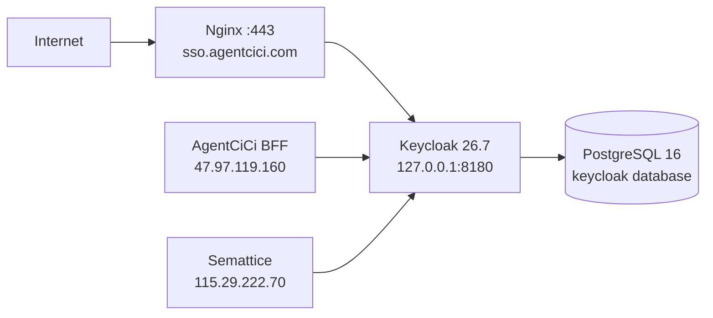

# FEAT-029 - Keycloak 生产 IdP 与数据平台认证接入

## 授权与目标

用户已明确授权在 ECS `115.29.222.70` 部署 Keycloak 并将 `sso.agentcici.com` 配置为统一 IdP，同时完成 AgentCiCi、CloudCC Semattice 及未来官方应用可扩展的认证互通。

本实现规格落实 `FEAT-028`，但不改变其中的信任边界：Keycloak 负责身份认证；官方访问上下文服务（ACS）签发短期 OACT；数据平台仍本地执行 scope、成员投影、RBAC、共享和 RLS。

## 生产部署拓扑

- Keycloak 使用独立 Linux 账号、`/opt/keycloak` release 目录、systemd unit、独立数据库 `keycloak` 与仅该库权限的 PostgreSQL role；绝不使用 Semattice 数据库或其 runtime/migrator role。
- Keycloak 仅监听 loopback `127.0.0.1:8180`；Nginx 在公网 TLS 终止后代理，并显式覆盖 `X-Forwarded-*` 头。现有 `*.agentcici.com` 证书覆盖 `sso.agentcici.com`。
- hostname 固定为 `https://sso.agentcici.com`，启用 `proxy-headers=xforwarded` 且只信任 `127.0.0.1`；健康与指标端点不得直接暴露公网。
- 管理员、数据库和 client secret 均只存服务器 root 可读配置；不得提交到任一仓库、终端输出或 Token 文档。

## Realm 与客户端

创建业务 Realm `agentcici`，`master` Realm 只保留 Keycloak 管理用途。首批客户端如下：

| Client ID | 类型 | 流程 | 用途 |
|---|---|---|---|
| `agentcici-bff` | confidential | authorization code + PKCE | AgentCiCi 用户登录 BFF |
| `semattice-api` | bearer-only/resource | 无浏览器流程 | Semattice API、远程 MCP、CLI audience |
| `semattice-cli` | public | device authorization（后续） | 人工 CLI 登录 |
| `official-access-context` | confidential service account | client credentials | ACS/官方上下文签发服务 |
| `followup-worker` | confidential service account | client credentials | 未来官方服务模板 |

所有 browser redirect URI 必须精确列出 AgentCiCi HTTPS callback；禁用 implicit、resource owner password 与 wildcard redirect。第三方按“第三方 × 公司 × 环境”创建独立 confidential service-account client，不可复用上述官方 client。

## 数据平台实现边界

1. 认证器从单一 HS256 升级为多 issuer：接受 ACS OACT（JWKS、`aud=semattice-api`）以及经显式 client/tenant binding 的第三方 Keycloak access token；旧 HS256 只保留受控兼容窗口，默认不再作为新调用路径。
2. 从 OACT 构造 `TrustedPrincipal`：`sub -> principal_id`，并强制单值 `tenant_id + company_id + scope`。任何请求 body/header/MCP 参数都不得覆盖这些字段。
3. 每次请求只执行本地 JWKS 缓存验签、issuer/audience/time/scope 与 `principal_projection.identity_version` 检查；不得回调 Keycloak。未知 kid 时可 single-flight 刷新 JWKS 一次。
4. 不带 Token 的 HTTP/MCP/CLI 必须 fail closed；stdio/CLI 到期后退出并要求宿主重新取 Token。
5. 增加受控成员投影消费者或内网 HTTPS endpoint，幂等写入 `(tenant_id, keycloak_sub)` 的 `principal_projection` 和最小 `principal_org_membership`。不直接跨库读写 AgentCiCi。

## 验收与回滚

- `https://sso.agentcici.com/realms/agentcici/.well-known/openid-configuration` 返回固定 issuer 与 TLS 校验成功；公网 `/health`、`/metrics` 不可访问。
- Nginx、Keycloak、PostgreSQL 的健康检查、重启、日志和数据库连接成功；Semattice `:8080` 与现有 HTTPS 路由保持健康。
- 生产变更前备份 Nginx 配置、创建时间戳 release/backup；Nginx 只在 `nginx -t` 成功后 reload。Keycloak 失败可 stop/disable unit 并删除新增 vhost，现有 Semattice 不受影响。
- 应用接入按先双验签观察、再官方 OACT、最后禁用旧路径的顺序灰度；每步均记录有效与拒绝 case 的证据。
